# Module 3: Orchestration and ML Pipelines

See this [GitHub page](https://github.com/DataTalksClub/mlops-zoomcamp/tree/main/03-orchestration) 
on [DataTalksClub/mlops-zoomcamp](https://github.com/DataTalksClub/mlops-zoomcamp).

In module 3, we will learn to use Prefect to orchestrate and observe our ML workflows.

## 3.1 Introdution to Workflow Orchestration

:movie_camera: [Youtube](https://www.youtube.com/watch?v=Cqb7wyaNF08&list=PL3MmuxUbc_hIUISrluw_A7wDSmfOhErJK&index=16).

Key Takeaways:

* The video discusses orchestration and machine learning (ML) pipelines with Prefect
* It introduces the concept of workflow orchestration and explains its importance for ML projects
* The challenges of working with complex systems are discussed, and how orchestration can help manage these challenges
* The benefits of using an orchestration tool like Prefect are also highlighted, including increased efficiency and reduced errors
* The video then dives into the Prefect UI tools and shows how they can help manage workflows through task visualization, error handling, and monitoring
* The video is a useful resource for anyone looking to learn more about workflow orchestration and how it can improve efficiency in ML pipelines.

### Intro to orchestration & ML pipelines with Prefect

> [00:00](https://www.youtube.com/watch?v=Cqb7wyaNF08&t=0s) - Intro to orchestration & ML pipelines with Prefect.

You might have an MLOps workflow that looks like this.

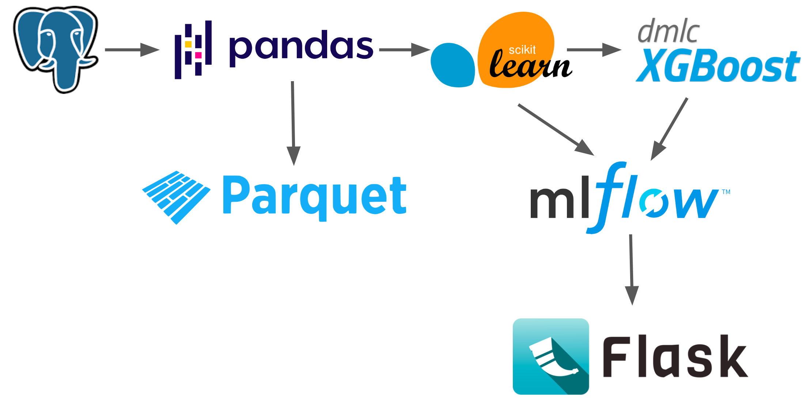

You could have:

* a database that retrieves data
* this could be picked up by a python script using pandas code to clean it up
* data is saved in a parquet file as a checkpoint, maybe readed back later
* scikit-learn used for engineering some features or running some models
* XGBoost to run a model
* MLflow can track anything saved by a database and information is written back and forth
* finally that your model is served via a [Flask](https://flask.palletsprojects.com/) or something like [FastAPI](https://fastapi.tiangolo.com/lo/)

We can have points of failure at many different parts of the workflow.

### Overview of challenges and benefits of workflow orchestration

> [02:49](https://www.youtube.com/watch?v=Cqb7wyaNF08&t=169s) - Overview of challenges and benefits of workflow orchestration.

If you give an MLOps engineer a job...

* Could you just set up this pipeline to train this model?
* Could you set up logging?
* Could you do it every day?
* Could you make it retry if it fails?
* Could you send me a message when it succeeds?
* Could you visualize the dependencies?
* Could you add caching?
* Could you add collaborators to run ad hoc - who don't code?

What is Prefect?<br>
It’s a flexible framework to build, reliably execute and observe your dataflow while supporting a wide variety of execution and data access patterns.<br>
See [Why Prefect](https://www.prefect.io/guide/blog/why-prefect/) from Anna Geller.

### Review: Prefect UI tools for complex systems and ML workflows

> [05:15](https://www.youtube.com/watch?v=Cqb7wyaNF08&t=315s) - Review: Prefect UI tools for complex systems and ML workflows.

In the Prefect UI you can quickly set up notifications, visualize run history, and schedule your dataflows.


Source: https://docs.prefect.io/2.10.12/ 

Prefect provides tools for working with comple systems so you can stop wondering about your workflows.

## 3.2 Introduction to Prefect

:movie_camera: [Youtube](https://www.youtube.com/watch?v=rTUBTvXvXvM&list=PL3MmuxUbc_hIUISrluw_A7wDSmfOhErJK&index=17).

Key Takeaways:

* The video is about Prefect and its various components.
* The video will provide an overview of Prefect terminology and show how to configure a local database.
* The process of setting up the environment and running scripts on the Prefect server will be demonstrated.
* The video will also show how to use retry logic and the workflow UI.
* Flow runs and logs in Prefect will be reviewed towards the end of the video.
* The video is suitable for those interested in learning more about Prefect and its capabilities.

### Introduction to Prefect and its components

> [00:00](https://www.youtube.com/watch?v=rTUBTvXvXvM&t=0s) - Introduction to Prefect and its components.

In this section we will see how regular python code can be converted into a perfect script and
we will run our own prefect server locally and run scripts on the server.

Goals:

* Clone GitHub repository
* Setup a conda environment
* Start a Prefect server
* Run a Prefect flow
* Checkout Prefect UI

Why use Prefect? Flexible, open-source Python framwork to turn standard pipelines into fault-tolerant dataflows.

Installation? See https://docs.prefect.io/latest/getting-started/installation/

Prefect is published as a Python package. To install the latest Prefect release, run the following in a shell or terminal session:

```bash
pip install -U prefect
```

### Overview of Prefect terminology and local database configuration

> [02:27](https://www.youtube.com/watch?v=rTUBTvXvXvM&t=147s) - Overview of Prefect terminology and local database configuration.

Self Hosting a Prefect Server

* **Orchestration API** - Used by server to work with workflow metadata
* **Database** - Stored workflow metadata
* **UI** - Visualizes workflows
* **Hosting a Prefect server** - See https://docs.prefect.io/latest/host/
* **Task** - A discrete unit of work in a Prefect workflow. See https://docs.prefect.io/latest/concepts/tasks/
* **Flow** - Container for workflow logic. See https://docs.prefect.io/latest/concepts/flows/
* **Subflow** - Flow called by another flow. See https://docs.prefect.io/latest/concepts/flows/#composing-flows

Below an example.

```python
from prefect import flow, task

@task(name="Print Hello")
def print_hello(name):
    msg = f"Hello {name}!"
    print(msg)
    return msg

@flow(name="Subflow")
def my_subflow(msg):
    print(f"Subflow says: {msg}")

@flow(name="Hello Flow")
def hello_world(name="world"):
    message = print_hello(name)
    my_subflow(message)

hello_world("Marvin")
```

### Setting up environment and running scripts on Prefect server

> [05:30](https://www.youtube.com/watch?v=rTUBTvXvXvM&t=330s) - Setting up environment and running scripts on Prefect server.

Create a conda environment.

```bash
mkdir mlops
cd mlops
# conda create -n prefect-ops python=3.9.12
# conda activate prefect-ops
# How to Manage Conda Environments on an Apple Silicon M1 Mac
# See https://towardsdatascience.com/how-to-manage-conda-environments-on-an-apple-silicon-m1-mac-1e29cb3bad12
create_x86_conda_environment prefect-ops python=3.9.12
python -V
```

You should see this.

```txt
Python 3.9.12
```

I recommend you to fork the `https://github.com/discdiver/prefect-mlops-zoomcamp.git` repository.

Clone this forked repository and install packages.

```bash
git clone git@github.com:boisalai/prefect-mlops-zoomcamp.git
cd prefect-mlops-zoomcamp
pip install -r requirements.txt
prefect version
```

Here, the content of the `requiements.txt` file.

```txt
black==23.3.0
fastparquet==2023.4.0
hyperopt==0.2.7
mlflow==2.3.1
pandas==2.0.1
prefect==2.10.8
prefect-aws==0.3.1
scikit_learn==1.2.2
seaborn==0.12.2
xgboost==1.7.5
orjson==3.8.1
```

You should see this.

```txt
Version:             2.10.8
API version:         0.8.4
Python version:      3.9.12
Git commit:          79093235
Built:               Mon, May 8, 2023 12:23 PM
OS/Arch:             darwin/x86_64
Profile:             default
Server type:         server
```

Start a local Prefect server by running the following.

```bash
prefect server start
```

You should see this.

```txt
 ___ ___ ___ ___ ___ ___ _____ 
| _ \ _ \ __| __| __/ __|_   _| 
|  _/   / _|| _|| _| (__  | |  
|_| |_|_\___|_| |___\___| |_|  

Configure Prefect to communicate with the server with:

    prefect config set PREFECT_API_URL=http://127.0.0.1:4200/api

View the API reference documentation at http://127.0.0.1:4200/docs

Check out the dashboard at http://127.0.0.1:4200
```

Open another terminal window and run the following commands to set the Prefect API URL.

```bash
conda activate prefect-ops
prefect config set PREFECT_API_URL=http://127.0.0.1:4200/api
```

You should see this.

```txt
Set 'PREFECT_API_URL' to 'http://127.0.0.1:4200/api'.
Updated profile 'default'.
```

### Demo of retry logic & workflow UI in action

> [9:50](https://www.youtube.com/watch?v=rTUBTvXvXvM&t=590s) - Demo of retry logic & workflow UI in action.

Go to the `prefect-mlops-zoomcamp/3.2` folder.
There are two Python scripts `cat_facts.py` and `cat_dog_facts.py` in this folder.
Below, the first one (`cat_facts.py`).

```python
import httpx
from prefect import flow, task


@task(retries=4, retry_delay_seconds=0.1, log_prints=True)
def fetch_cat_fact():
    cat_fact = httpx.get("https://f3-vyx5c2hfpq-ue.a.run.app/")
    # An endpoint that is designed to fail sporadically
    if cat_fact.status_code >= 400:
        raise Exception()
    print(cat_fact.text)


@flow
def fetch():
    fetch_cat_fact()


if __name__ == "__main__":
    fetch()
```

This script calls an API to retreive cats. The function calling the API has been decorated with a task decorator
which has been configured with some arguments.

* Prefect will retry the task upo to 4 times if the task were to fail for some reason.
* Between each retry, Prefect will wait for a short period of time before trying to run the task again.
* Lastly, any print statements that are made within this task will be shared within the logs whenever this script is run.

Open a new terminal window, and run the `cat_facts.py` script with the following commands.

```bash
cd prefect-mlops-zoomcamp/3.2
conda activate prefect-ops
python cat_facts.py
```

You should see this in the terminal and in the Prefect dashboard at http://127.0.0.1:4200.

On the left, we see that the flow encountered an exception during the execution.
On the right, we see a timeline of the flow run and the logs that were produced down at the bottom.

<table>
    <tr>
        <td>
            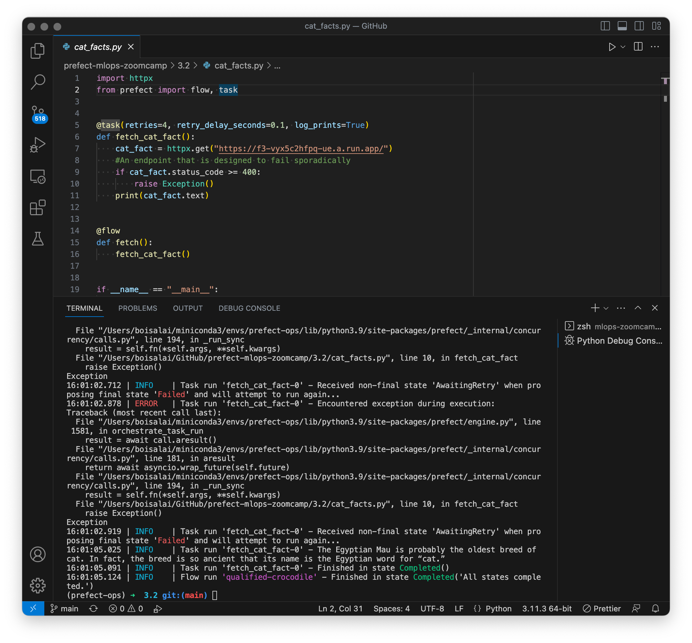
        </td>
        <td>
            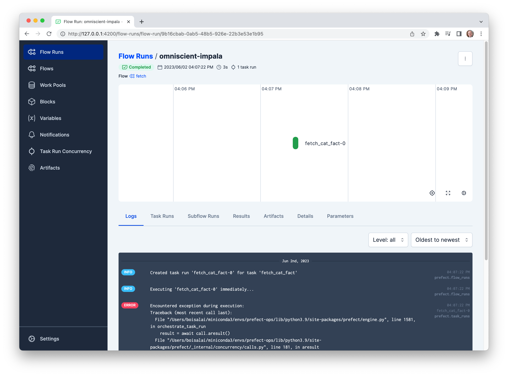
        </td>
    </tr>
</table>

Let's try running the other script in the folder.

Below, the `cat_dog_facts.py` code.

```python
import httpx
from prefect import flow

@flow
def fetch_cat_fact():
    '''A flow that gets a cat fact'''
    return httpx.get("https://catfact.ninja/fact?max_length=140").json()["fact"]

@flow
def fetch_dog_fact():
    '''A flow that gets a dog fact'''
    return httpx.get(
        "https://dogapi.dog/api/v2/facts",
        headers={"accept": "application/json"},
    ).json()["data"][0]["attributes"]["body"]

@flow(log_prints=True)
def animal_facts():
    cat_fact = fetch_cat_fact()
    dog_fact = fetch_dog_fact()
    print(f"🐱: {cat_fact} \n🐶: {dog_fact}")

if __name__ == "__main__":
    animal_facts()
```

We have a parent flow at the bottom which calls the `dog_fact` flow and `cat_fact` flow.
Run this script with the following commands and see what happens.

```bash
cd prefect-mlops-zoomcamp/3.2
conda activate prefect-ops
python cat_dog_facts.py
```

You should see three new flow run records (`animal-facts`, `fetch-cat-fact`, `fetch-dog-fact`) that's because we had three flows in the script.
Let's take a look at the record for the parent flow called `animal-facts`.

<table>
    <tr>
        <td>
            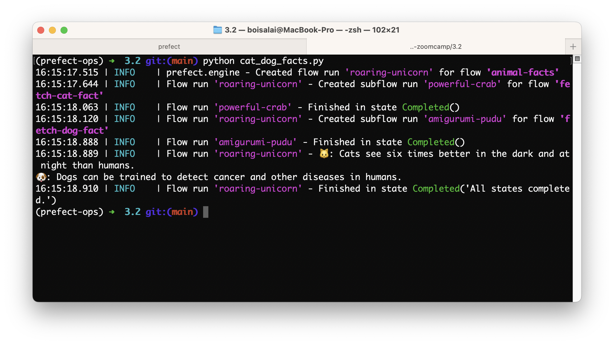
        </td>
        <td>
            
        </td>
    </tr>
</table>

## 3.3 Prefect Workflow

:movie_camera: [Youtube](https://www.youtube.com/watch?v=x3bV8yMKjtc&list=PL3MmuxUbc_hIUISrluw_A7wDSmfOhErJK&index=18).

Key Takeaways:

* The video is about productionizing a Jupyter notebook into a Python script using Prefect
* It covers a review of code overview and data import for an ML model, data read-in, feature engineering, and model training process
* It also explains how to add orchestration and observability with Prefect, use caching and decorators in ML flow, and gives an overview of using Prefect for data flow orchestration
* The video provides a comprehensive guide on how to use Prefect to productionize a Jupyter notebook into a Python script for an ML model.

### Productionizing notebook into python script with Prefect

> [00:00](https://www.youtube.com/watch?v=x3bV8yMKjtc&list=PL3MmuxUbc_hIUISrluw_A7wDSmfOhErJK&index=18&t=0s) Productionizing notebook into python script with Prefect.

### Review: Code overview and data import for ML model

> [03:06](https://www.youtube.com/watch?v=x3bV8yMKjtc&list=PL3MmuxUbc_hIUISrluw_A7wDSmfOhErJK&index=18&t=186s) Review: Code overview and data import for ML model.

we review the following two codes:

* [`duration_prediction_original.ipynb`](https://github.com/discdiver/prefect-mlops-zoomcamp/blob/main/3.3/duration_prediction_original.ipynb).
* [`orchestrate_pre_prefect.py`](https://github.com/discdiver/prefect-mlops-zoomcamp/blob/main/3.3/orchestrate_pre_prefect.py)

Here `orchestrate_pre_prefect.py`.

```python
import pathlib
import pickle
import pandas as pd
import numpy as np
import scipy
import sklearn
from sklearn.feature_extraction import DictVectorizer
from sklearn.metrics import mean_squared_error
import mlflow
import xgboost as xgb
from prefect import flow, task


def read_data(filename: str) -> pd.DataFrame:
    """Read data into DataFrame"""
    df = pd.read_parquet(filename)

    df.lpep_dropoff_datetime = pd.to_datetime(df.lpep_dropoff_datetime)
    df.lpep_pickup_datetime = pd.to_datetime(df.lpep_pickup_datetime)

    df["duration"] = df.lpep_dropoff_datetime - df.lpep_pickup_datetime
    df.duration = df.duration.apply(lambda td: td.total_seconds() / 60)

    df = df[(df.duration >= 1) & (df.duration <= 60)]

    categorical = ["PULocationID", "DOLocationID"]
    df[categorical] = df[categorical].astype(str)

    return df


def add_features(
    df_train: pd.DataFrame, df_val: pd.DataFrame
) -> tuple(
    [
        scipy.sparse._csr.csr_matrix,
        scipy.sparse._csr.csr_matrix,
        np.ndarray,
        np.ndarray,
        sklearn.feature_extraction.DictVectorizer,
    ]
):
    """Add features to the model"""
    df_train["PU_DO"] = df_train["PULocationID"] + "_" + df_train["DOLocationID"]
    df_val["PU_DO"] = df_val["PULocationID"] + "_" + df_val["DOLocationID"]

    categorical = ["PU_DO"]  #'PULocationID', 'DOLocationID']
    numerical = ["trip_distance"]

    dv = DictVectorizer()

    train_dicts = df_train[categorical + numerical].to_dict(orient="records")
    X_train = dv.fit_transform(train_dicts)

    val_dicts = df_val[categorical + numerical].to_dict(orient="records")
    X_val = dv.transform(val_dicts)

    y_train = df_train["duration"].values
    y_val = df_val["duration"].values
    return X_train, X_val, y_train, y_val, dv


def train_best_model(
    X_train: scipy.sparse._csr.csr_matrix,
    X_val: scipy.sparse._csr.csr_matrix,
    y_train: np.ndarray,
    y_val: np.ndarray,
    dv: sklearn.feature_extraction.DictVectorizer,
) -> None:
    """train a model with best hyperparams and write everything out"""

    with mlflow.start_run():
        train = xgb.DMatrix(X_train, label=y_train)
        valid = xgb.DMatrix(X_val, label=y_val)

        best_params = {
            "learning_rate": 0.09585355369315604,
            "max_depth": 30,
            "min_child_weight": 1.060597050922164,
            "objective": "reg:linear",
            "reg_alpha": 0.018060244040060163,
            "reg_lambda": 0.011658731377413597,
            "seed": 42,
        }

        mlflow.log_params(best_params)

        booster = xgb.train(
            params=best_params,
            dtrain=train,
            num_boost_round=100,
            evals=[(valid, "validation")],
            early_stopping_rounds=20,
        )

        y_pred = booster.predict(valid)
        rmse = mean_squared_error(y_val, y_pred, squared=False)
        mlflow.log_metric("rmse", rmse)

        pathlib.Path("models").mkdir(exist_ok=True)
        with open("models/preprocessor.b", "wb") as f_out:
            pickle.dump(dv, f_out)
        mlflow.log_artifact("models/preprocessor.b", artifact_path="preprocessor")

        mlflow.xgboost.log_model(booster, artifact_path="models_mlflow")
    return None


def main_flow(
    train_path: str = "./data/green_tripdata_2021-01.parquet",
    val_path: str = "./data/green_tripdata_2021-02.parquet",
) -> None:
    """The main training pipeline"""

    # MLflow settings
    mlflow.set_tracking_uri("sqlite:///mlflow.db")
    mlflow.set_experiment("nyc-taxi-experiment")

    # Load
    df_train = read_data(train_path)
    df_val = read_data(val_path)

    # Transform
    X_train, X_val, y_train, y_val, dv = add_features(df_train, df_val)

    # Train
    train_best_model(X_train, X_val, y_train, y_val, dv)


if __name__ == "__main__":
    main_flow()
```

Download the two parquet files from [NYC TLC Trip Record Data](https://www.nyc.gov/site/tlc/about/tlc-trip-record-data.page) 
and save them in the directory `prefect-mlops-zoomcamp/data`. 

```bash
cd prefect-mlops-zoomcamp
wget -P ./data https://d37ci6vzurychx.cloudfront.net/trip-data/green_tripdata_2021-01.parquet
wget -P ./data https://d37ci6vzurychx.cloudfront.net/trip-data/green_tripdata_2021-02.parquet
git add .
git commit -m "Parquet files added"
git push -u origin main
```

Remember I'm working on a forked github repo (https://github.com/boisalai/prefect-mlops-zoomcamp).

### Review: data read-in, feature engineering, model training

> [05:59](https://www.youtube.com/watch?v=x3bV8yMKjtc&list=PL3MmuxUbc_hIUISrluw_A7wDSmfOhErJK&index=18&t=359s) Review: data read-in, feature engineering, model training.

### Adding orchestration and observability with Prefect

> [08:43](https://www.youtube.com/watch?v=x3bV8yMKjtc&list=PL3MmuxUbc_hIUISrluw_A7wDSmfOhErJK&index=18&t=523s) Adding orchestration and observability with Prefect.

Run the following commands.

```bash
cd prefect-mlops-zoomcamp
conda activate prefect-ops
python 3.3/orchestrate_pre_prefect.py
```

You should get this.

<table>
    <tr>
        <td>
            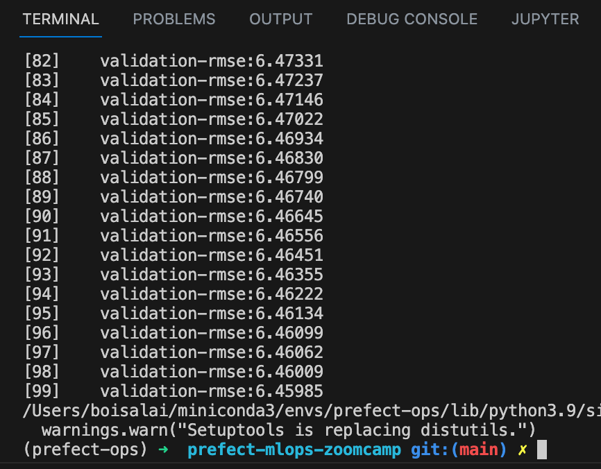
        </td>
        <td>
            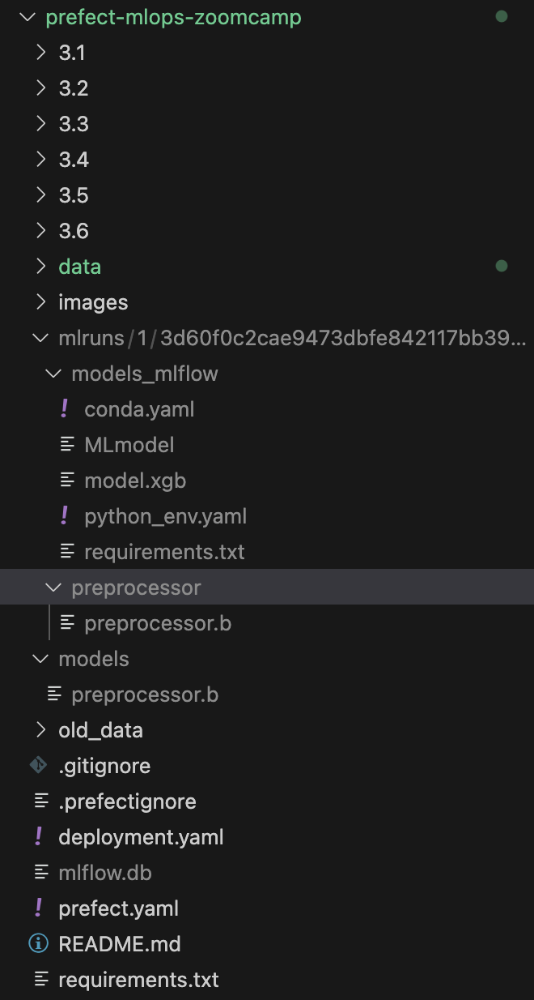
        </td>
    </tr>
</table>

Now, we create [`orchestrate.py`](https://github.com/discdiver/prefect-mlops-zoomcamp/blob/main/3.3/orchestrate.py) script in which we added Prefect decorators.

```python
import pathlib
import pickle
import pandas as pd
import numpy as np
import scipy
import sklearn
from sklearn.feature_extraction import DictVectorizer
from sklearn.metrics import mean_squared_error
import mlflow
import xgboost as xgb
from prefect import flow, task


@task(retries=3, retry_delay_seconds=2)
def read_data(filename: str) -> pd.DataFrame:
    """Read data into DataFrame"""
    df = pd.read_parquet(filename)

    df.lpep_dropoff_datetime = pd.to_datetime(df.lpep_dropoff_datetime)
    df.lpep_pickup_datetime = pd.to_datetime(df.lpep_pickup_datetime)

    df["duration"] = df.lpep_dropoff_datetime - df.lpep_pickup_datetime
    df.duration = df.duration.apply(lambda td: td.total_seconds() / 60)

    df = df[(df.duration >= 1) & (df.duration <= 60)]

    categorical = ["PULocationID", "DOLocationID"]
    df[categorical] = df[categorical].astype(str)

    return df


@task
def add_features(
    df_train: pd.DataFrame, df_val: pd.DataFrame
) -> tuple(
    [
        scipy.sparse._csr.csr_matrix,
        scipy.sparse._csr.csr_matrix,
        np.ndarray,
        np.ndarray,
        sklearn.feature_extraction.DictVectorizer,
    ]
):
    """Add features to the model"""
    df_train["PU_DO"] = df_train["PULocationID"] + "_" + df_train["DOLocationID"]
    df_val["PU_DO"] = df_val["PULocationID"] + "_" + df_val["DOLocationID"]

    categorical = ["PU_DO"]  #'PULocationID', 'DOLocationID']
    numerical = ["trip_distance"]

    dv = DictVectorizer()

    train_dicts = df_train[categorical + numerical].to_dict(orient="records")
    X_train = dv.fit_transform(train_dicts)

    val_dicts = df_val[categorical + numerical].to_dict(orient="records")
    X_val = dv.transform(val_dicts)

    y_train = df_train["duration"].values
    y_val = df_val["duration"].values
    return X_train, X_val, y_train, y_val, dv


@task(log_prints=True)
def train_best_model(
    X_train: scipy.sparse._csr.csr_matrix,
    X_val: scipy.sparse._csr.csr_matrix,
    y_train: np.ndarray,
    y_val: np.ndarray,
    dv: sklearn.feature_extraction.DictVectorizer,
) -> None:
    """train a model with best hyperparams and write everything out"""

    with mlflow.start_run():
        train = xgb.DMatrix(X_train, label=y_train)
        valid = xgb.DMatrix(X_val, label=y_val)

        best_params = {
            "learning_rate": 0.09585355369315604,
            "max_depth": 30,
            "min_child_weight": 1.060597050922164,
            "objective": "reg:linear",
            "reg_alpha": 0.018060244040060163,
            "reg_lambda": 0.011658731377413597,
            "seed": 42,
        }

        mlflow.log_params(best_params)

        booster = xgb.train(
            params=best_params,
            dtrain=train,
            num_boost_round=100,
            evals=[(valid, "validation")],
            early_stopping_rounds=20,
        )

        y_pred = booster.predict(valid)
        rmse = mean_squared_error(y_val, y_pred, squared=False)
        mlflow.log_metric("rmse", rmse)

        pathlib.Path("models").mkdir(exist_ok=True)
        with open("models/preprocessor.b", "wb") as f_out:
            pickle.dump(dv, f_out)
        mlflow.log_artifact("models/preprocessor.b", artifact_path="preprocessor")

        mlflow.xgboost.log_model(booster, artifact_path="models_mlflow")
    return None


@flow
def main_flow(
    train_path: str = "./data/green_tripdata_2021-01.parquet",
    val_path: str = "./data/green_tripdata_2021-02.parquet",
) -> None:
    """The main training pipeline"""

    # MLflow settings
    mlflow.set_tracking_uri("sqlite:///mlflow.db")
    mlflow.set_experiment("nyc-taxi-experiment")

    # Load
    df_train = read_data(train_path)
    df_val = read_data(val_path)

    # Transform
    X_train, X_val, y_train, y_val, dv = add_features(df_train, df_val)

    # Train
    train_best_model(X_train, X_val, y_train, y_val, dv)


if __name__ == "__main__":
    main_flow()
```

### Explanation of using caching and adding decorators in ML flow

> [11:42](https://www.youtube.com/watch?v=x3bV8yMKjtc&list=PL3MmuxUbc_hIUISrluw_A7wDSmfOhErJK&index=18&t=702s) Explanation of using caching and adding decorators in ML flow.

See [Caching](https://docs.prefect.io/2.10.12/concepts/tasks/#caching) for explanation.

### Overview of using Prefect for data flow orchestration

> [14:50](https://www.youtube.com/watch?v=x3bV8yMKjtc&list=PL3MmuxUbc_hIUISrluw_A7wDSmfOhErJK&index=18&t=890s) Overview of using Prefect for data flow orchestration.

Start a local Prefect server by running the following.

```bash
conda activate prefect-ops
prefect server start
```

Now, run the flow.

```bash
python 3.3/orchestrate.py  
```

You should get this.
We have logging information in the terminal window and in the Prefect UI.

<table>
    <tr>
        <td>
            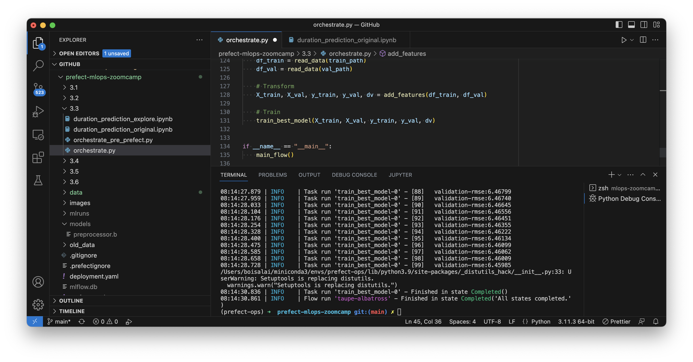
        </td>
        <td>
            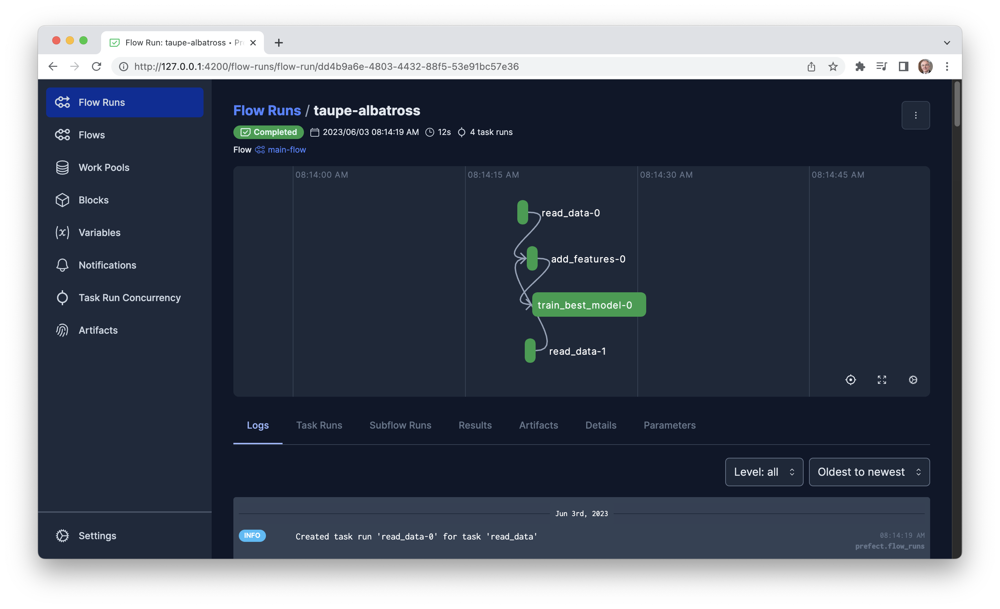
        </td>
    </tr>
</table>

## 3.4 Deploying Your Workflow

:movie_camera: [Youtube](https://www.youtube.com/watch?v=3YjagezFhOo&list=PL3MmuxUbc_hIUISrluw_A7wDSmfOhErJK&index=19).

Key Takeaways:

* The video teaches how to deploy workflows using Prefect projects for productionizing.
* It covers configuring the project and deployment with the pull step.
* It explains how to deploy and run a flow with a worker pool.
* It explores how to set up deployment from GitHub for collaboration purposes.
* The video is suitable for anyone who wants to learn how to deploy workflows using Prefect projects and collaborate with others on GitHub.

### Deploying workflow using Prefect project for productionizing

> [00:00](https://www.youtube.com/watch?v=3YjagezFhOo&list=PL3MmuxUbc_hIUISrluw_A7wDSmfOhErJK&index=19&t=0s) Deploying workflow using Prefect project for productionizing.

```bash
cd prefect-mlops-zoomcamp
git remote -v
```

You should get something like this. 
Remember I'm working on a forked github repo.

```txt
origin	git@github.com:boisalai/prefect-mlops-zoomcamp.git (fetch)
origin	git@github.com:boisalai/prefect-mlops-zoomcamp.git (push)
``` 

A project is a minimally opinionated set of files that describe how to prepare one or more 
[flow deployments](https://docs.prefect.io/concepts/deployments/). At a high level, a project is a 
directory with the following key files stored in the root:

* [`deployment.yaml`](https://docs.prefect.io/2.10.12/concepts/projects/#the-deployment-yaml-file): a YAML file describing base settings for deployments produced from this project
* [`prefect.yaml`](https://docs.prefect.io/2.10.12/concepts/projects/#the-prefect-yaml-file): a YAML file describing procedural steps for preparing a deployment from this project, as well as instructions for preparing the execution environment for a deployment run
* [`.prefect/`](https://docs.prefect.io/2.10.12/concepts/projects/#the-prefect-directory): a hidden directory where Prefect will store workflow metadata

See [Projects](https://docs.prefect.io/2.10.12/concepts/projects/) for more.

Projects can be initialized by running the CLI command `prefect project init` in any directory that you consider to be the root of a project.
Make sure some files are deleted before

```bash
rm deployment.yaml prefect.yaml .prefectignore 
rm -rf .prefect/
prefect project init
```

You should get something like this.

```txt
Created project in [...]/prefect-mlops-zoomcamp with the following new files:
.prefectignore
deployment.yaml
prefect.yaml
.prefect/
``` 

The `deployment.yaml` file, the `prefect.yaml` file, the `.prefectignore` file and the `.prefect/` folder should been created.

### Configuring project and deployment with pull step

> [03:12](https://www.youtube.com/watch?v=3YjagezFhOo&list=PL3MmuxUbc_hIUISrluw_A7wDSmfOhErJK&index=19&t=192s) Configuring project and deployment with pull step.

Here is the `prefect.yaml` file.
Remember I'm working on a forked github repo.

```yaml
# File for configuring project / deployment build, push and pull steps

# Generic metadata about this project
name: prefect-mlops-zoomcamp
prefect-version: 2.10.8

# build section allows you to manage and build docker images
build: null

# push section allows you to manage if and how this project is uploaded to remote locations
push: null

# pull section allows you to provide instructions for cloning this project in remote locations
pull:
- prefect.projects.steps.git_clone_project:
    repository: git@github.com:boisalai/prefect-mlops-zoomcamp.git
    branch: main
    access_token: null
```

[Prefect 2](https://www.prefect.io/guide/blog/introducing-prefect-2-0/) introduced the concept of a [deployment](https://docs.prefect.io/concepts/deployments/), 
which encapsulates everything Prefect knows about an instance of a flow, but getting flow code to run anywhere other than where it was written is tricky — a lot 
of things need to be in the right place, with the right configuration, at the right time. Deployments often have critical, implicit dependencies on build 
artifacts, such as containers, that are created and stored outside of Prefect. Each of these dependencies presents a potential stumbling block when 
deploying a flow for remote execution — you must satisfy them for your flow to run successfully.

Prefect is introducing **workers** and **projects** in beta to address this challenge.

* [Workers](https://docs.prefect.io/concepts/work-pools/) are services that run in your desired execution environment, 
where your flow code will run. Each worker manages flow run infrastructure of a specific type and must pull from a work 
pool with a matching type. 
* [Projects](https://docs.prefect.io/concepts/projects/) are a contract between you and a worker, specifying what you do when you create a deployment, and what the worker will do before it kicks off that deployment. 

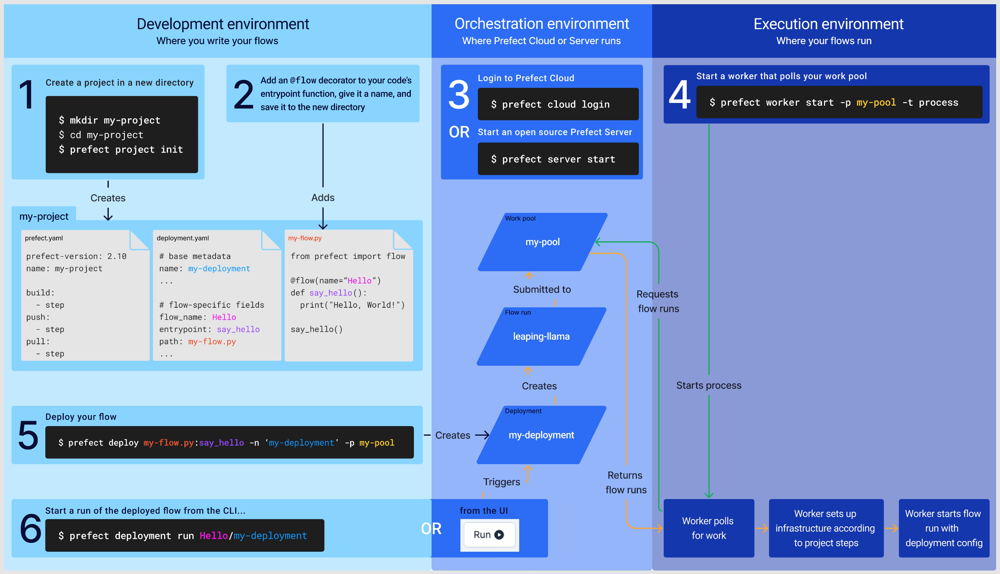

See [Introducing Prefect Workers and Projects](https://www.prefect.io/guide/blog/introducing-prefect-workers-and-projects/) for more.

Set up a work pool with a local subprocess as the infrastructure. 
Go to the Prefect UI, and create a new **Work Pools** with the name `zoompool` and **Process** in the **Type** field.

<table>
    <tr>
        <td>
            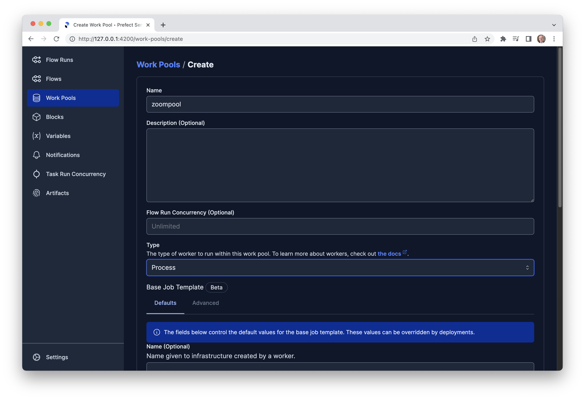
        </td>
        <td>
            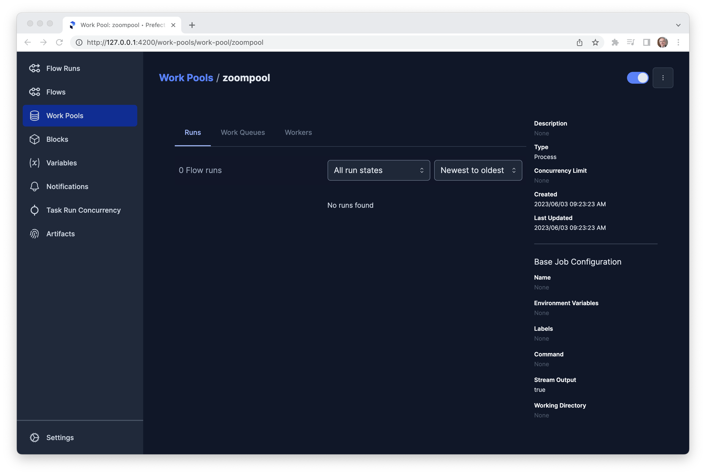
        </td>
    </tr>
</table>

### Deploying and running a flow with a worker pool

> [06:48](https://www.youtube.com/watch?v=3YjagezFhOo&list=PL3MmuxUbc_hIUISrluw_A7wDSmfOhErJK&index=19&t=408s) Deploying and running a flow with a worker pool.

Now, we will do **Step 5** (see previous figure) and deploy a flow from this project by creating a deployment. 
Run the following from the project root directory.

```bash
cd prefect-mlops-zoomcamp
prefect deploy 3.4/orchestrate.py:main_flow -n taxi1 -p zoompool 
```

You should get something like this.

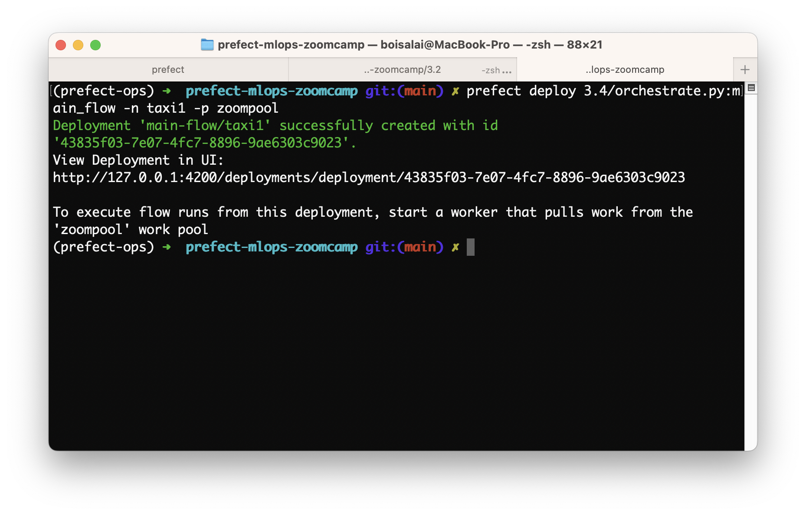

Next, we will do **Step 4** (see previous figure) and start a worker that pools our work pool.
This command should create the pool automatically if it didn't already exist.

```bash
prefect worker start -p zoompool
```
You should get this.

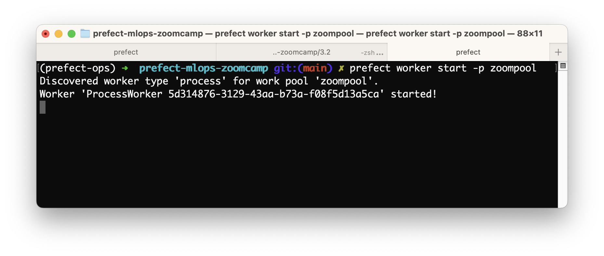

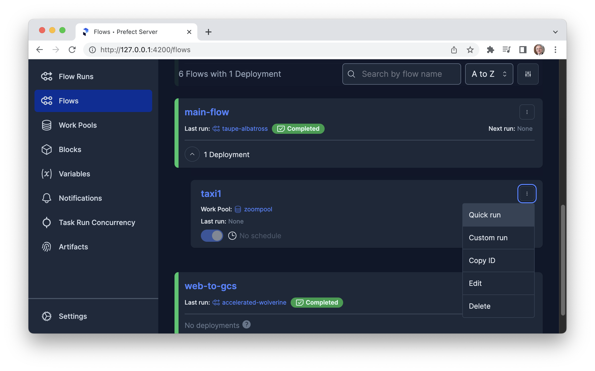

In the Prefect UI, select **Flows** and **main-flow**. You should see **taxi1** deployment on **zoompool** work pool. 
Click on **Quick run**.

You should get something like this.

<table>
    <tr>
        <td>
            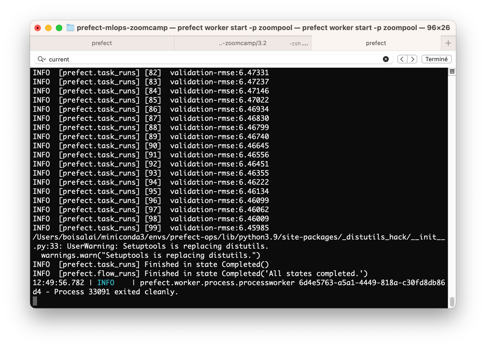
        </td>
        <td>
            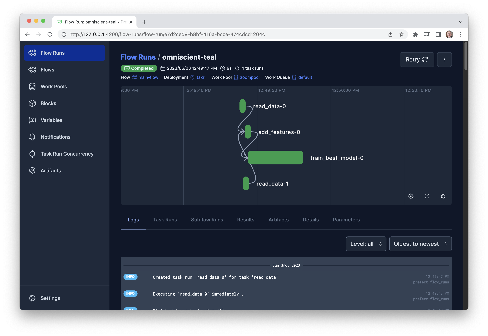
        </td>
    </tr>
</table>

Finish by pushing to our repo. 

```bash
git add .
git commit -m "Push after 3.4 Deploying Your Workflow"
git push -u origin main
```

### Setting up deployment from GitHub for collaboration

> [10:23](https://www.youtube.com/watch?v=3YjagezFhOo&list=PL3MmuxUbc_hIUISrluw_A7wDSmfOhErJK&index=19&t=623s) Setting up deployment from GitHub for collaboration.

## 3.5 Working with Deployments

:movie_camera: [Youtube](https://www.youtube.com/watch?v=jVmaaqs63O8&list=PL3MmuxUbc_hIUISrluw_A7wDSmfOhErJK&index=20).

Key Takeaways:

* The video discusses Prefect deployments and S3 data retrieval, including creating and accessing AWS credentials and S3 bucket
* It provides a step-by-step guide on how to create AWS credentials and S3 bucket, and how to create and save an S3 bucket object using Python code
* The video also covers using the S3 bucket block in Prefect, creating and deploying an S3 file with a markdown artifact, customizing parameters for flow runs, and setting up schedules for deployments
* By the end of the video, viewers will have a comprehensive understanding of using AWS credentials and S3 bucket in Prefect.

### Review: Prefect deployments and S3 data retrieval explained

> [00:00](https://www.youtube.com/watch?v=jVmaaqs63O8&list=PL3MmuxUbc_hIUISrluw_A7wDSmfOhErJK&index=20&t=0s) Review: Prefect deployments and S3 data retrieval explained.

### AWS credentials block creation and S3 bucket access

> [03:44](https://www.youtube.com/watch?v=jVmaaqs63O8&list=PL3MmuxUbc_hIUISrluw_A7wDSmfOhErJK&index=20&t=224s) AWS credentials block creation and S3 bucket access.

The [`create_s3_bucket_block.py`](https://github.com/discdiver/prefect-mlops-zoomcamp/blob/main/3.5/create_s3_bucket_block.py) script below 
creates an AWS Credentials and a S3 bucket block.

```python
import os

from time import sleep
from prefect_aws import S3Bucket, AwsCredentials


def create_aws_creds_block():
    # Before, set your keys in the terminal with `export AWS_ACCESS_KEY_ID=XXXXXXXXXXXXXXXXX`.
    # See https://docs.wandb.ai/guides/track/environment-variables
    # API secret keys should never be put in a client-side code or should be hidden.
    AWS_ACCESS_KEY_ID = os.environ.get('AWS_ACCESS_KEY_ID')
    AWS_SECRET_ACCESS_KEY = os.environ.get('AWS_SECRET_ACCESS_KEY')

    my_aws_creds_obj = AwsCredentials(
        aws_access_key_id=AWS_ACCESS_KEY_ID, 
        aws_secret_access_key=AWS_SECRET_ACCESS_KEY
    )
    my_aws_creds_obj.save(name="my-aws-creds", overwrite=True)


def create_s3_bucket_block():
    aws_creds = AwsCredentials.load("my-aws-creds")
    my_s3_bucket_obj = S3Bucket(
        bucket_name="my-first-bucket-abc", credentials=aws_creds
    )
    my_s3_bucket_obj.save(name="s3-bucket-example", overwrite=True)


if __name__ == "__main__":
    create_aws_creds_block()
    sleep(5)
    create_s3_bucket_block()
```

To use these blocks, we need to install [`prefect-aws`](https://github.com/PrefectHQ/prefect-aws) in your current environment.

```bash
pip install prefect-aws
```

Note that this package is already installed from [`requirements.txt`](https://github.com/discdiver/prefect-mlops-zoomcamp/blob/main/requirements.txt).

See also [Coordinate and incorporate AWS in your dataflow with `prefect-aws`](https://prefecthq.github.io/prefect-aws/)
for more information and [`prefect_aws.s3`](https://prefecthq.github.io/prefect-aws/s3/) for tasks for interacting with AWS S3 documentation.

Go to **AWS Console** and **IAM Users**, click on **Add users** button. Call this user `mlops-zoom-user`,
perhaps whatever you want that's descriptive. Click **Next** button.

Select **Add user to group** and click on **Create group** button.
Call this group `s3access`, select `AmazonS3FullAccess` and click on **Create user group** button. 

So, select this `s3access` group for the new user and click on **Next** button, then click on **Create user** button.

You should see this.

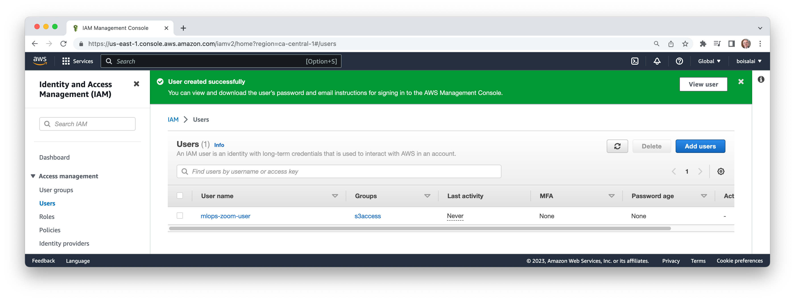

### Creating AWS credentials and S3 bucket

> [07:15](https://www.youtube.com/watch?v=jVmaaqs63O8&list=PL3MmuxUbc_hIUISrluw_A7wDSmfOhErJK&index=20&t=435s) Creating AWS credentials and S3 bucket.

Select `mlops-zoom-user`, select **Security credentials** tab, scroll down to **Access keys** section and click on **Create access key**.

In **Access key best practices & alternatives**, select **Other** and click on **Next** Button.
Add descripion if you want and click on **Create access key** button.

Copy the access key and the secret access key for later use.

### Python code creates and saves S3 bucket object

> [11:14](https://www.youtube.com/watch?v=jVmaaqs63O8&list=PL3MmuxUbc_hIUISrluw_A7wDSmfOhErJK&index=20&t=674s) Python code creates and saves S3 bucket object.

The instructor complete [`create_s3_bucket_block.py`](https://github.com/discdiver/prefect-mlops-zoomcamp/blob/main/3.5/create_s3_bucket_block.py) code then run the script.

> 12:34

```bash
python 3.5/create_s3_bucket_block.py
```

> 12:54 

If we go to the Prefect UI, **Blocks** console, we should see **my-aws-creds** block and **s3-bucket-example** block.

> 13:47 

The following command shows you all of the blocks you’ve created.

```bash
prefect block ls
```

> 14:04 

The following command shows what types of blocks we have available.

```bash
prefect block type ls
```
### Overview of using S3 bucket block in Prefect

> [14:47](https://www.youtube.com/watch?v=jVmaaqs63O8&list=PL3MmuxUbc_hIUISrluw_A7wDSmfOhErJK&index=20&t=887s) Overview of using S3 bucket block in Prefect.

The following command register all those blocks now the server knows that block type exists.

```bash
prefect block register -m prefect_aws
```

If you go on the server (Prefect UI) and add a new block, we will have AWS credentials

> 16:00 Artifacts

The instructor creates [`orchestrate_s3.py`](https://github.com/DataTalksClub/mlops-zoomcamp/blob/main/03-orchestration/3.5/orchestrate_s3.py).

```python
import pathlib
import pickle
import pandas as pd
import numpy as np
import scipy
import sklearn
from sklearn.feature_extraction import DictVectorizer
from sklearn.metrics import mean_squared_error
import mlflow
import xgboost as xgb
from prefect import flow, task
from prefect_aws import S3Bucket
from prefect.artifacts import create_markdown_artifact
from datetime import date


@task(retries=3, retry_delay_seconds=2)
def read_data(filename: str) -> pd.DataFrame:
    """Read data into DataFrame"""
    df = pd.read_parquet(filename)

    df.lpep_dropoff_datetime = pd.to_datetime(df.lpep_dropoff_datetime)
    df.lpep_pickup_datetime = pd.to_datetime(df.lpep_pickup_datetime)

    df["duration"] = df.lpep_dropoff_datetime - df.lpep_pickup_datetime
    df.duration = df.duration.apply(lambda td: td.total_seconds() / 60)

    df = df[(df.duration >= 1) & (df.duration <= 60)]

    categorical = ["PULocationID", "DOLocationID"]
    df[categorical] = df[categorical].astype(str)

    return df


@task
def add_features(
    df_train: pd.DataFrame, df_val: pd.DataFrame
) -> tuple(
    [
        scipy.sparse._csr.csr_matrix,
        scipy.sparse._csr.csr_matrix,
        np.ndarray,
        np.ndarray,
        sklearn.feature_extraction.DictVectorizer,
    ]
):
    """Add features to the model"""
    df_train["PU_DO"] = df_train["PULocationID"] + "_" + df_train["DOLocationID"]
    df_val["PU_DO"] = df_val["PULocationID"] + "_" + df_val["DOLocationID"]

    categorical = ["PU_DO"]  #'PULocationID', 'DOLocationID']
    numerical = ["trip_distance"]

    dv = DictVectorizer()

    train_dicts = df_train[categorical + numerical].to_dict(orient="records")
    X_train = dv.fit_transform(train_dicts)

    val_dicts = df_val[categorical + numerical].to_dict(orient="records")
    X_val = dv.transform(val_dicts)

    y_train = df_train["duration"].values
    y_val = df_val["duration"].values
    return X_train, X_val, y_train, y_val, dv


@task(log_prints=True)
def train_best_model(
    X_train: scipy.sparse._csr.csr_matrix,
    X_val: scipy.sparse._csr.csr_matrix,
    y_train: np.ndarray,
    y_val: np.ndarray,
    dv: sklearn.feature_extraction.DictVectorizer,
) -> None:
    """train a model with best hyperparams and write everything out"""

    with mlflow.start_run():
        train = xgb.DMatrix(X_train, label=y_train)
        valid = xgb.DMatrix(X_val, label=y_val)

        best_params = {
            "learning_rate": 0.09585355369315604,
            "max_depth": 30,
            "min_child_weight": 1.060597050922164,
            "objective": "reg:linear",
            "reg_alpha": 0.018060244040060163,
            "reg_lambda": 0.011658731377413597,
            "seed": 42,
        }

        mlflow.log_params(best_params)

        booster = xgb.train(
            params=best_params,
            dtrain=train,
            num_boost_round=100,
            evals=[(valid, "validation")],
            early_stopping_rounds=20,
        )

        y_pred = booster.predict(valid)
        rmse = mean_squared_error(y_val, y_pred, squared=False)
        mlflow.log_metric("rmse", rmse)

        pathlib.Path("models").mkdir(exist_ok=True)
        with open("models/preprocessor.b", "wb") as f_out:
            pickle.dump(dv, f_out)
        mlflow.log_artifact("models/preprocessor.b", artifact_path="preprocessor")

        mlflow.xgboost.log_model(booster, artifact_path="models_mlflow")

        markdown__rmse_report = f"""# RMSE Report

        ## Summary

        Duration Prediction 

        ## RMSE XGBoost Model

        | Region    | RMSE |
        |:----------|-------:|
        | {date.today()} | {rmse:.2f} |
        """

        create_markdown_artifact(
            key="duration-model-report", markdown=markdown__rmse_report
        )

    return None


@flow
def main_flow_s3(
    train_path: str = "./data/green_tripdata_2021-01.parquet",
    val_path: str = "./data/green_tripdata_2021-02.parquet",
) -> None:
    """The main training pipeline"""

    # MLflow settings
    mlflow.set_tracking_uri("sqlite:///mlflow.db")
    mlflow.set_experiment("nyc-taxi-experiment")

    # Load
    s3_bucket_block = S3Bucket.load("s3-bucket-block")
    s3_bucket_block.download_folder_to_path(from_folder="data", to_folder="data")

    df_train = read_data(train_path)
    df_val = read_data(val_path)

    # Transform
    X_train, X_val, y_train, y_val, dv = add_features(df_train, df_val)

    # Train
    train_best_model(X_train, X_val, y_train, y_val, dv)


if __name__ == "__main__":
    main_flow_s3()
```

The main changes are as follows.

We import this library.

```python
from prefect_aws import S3Bucket
```

We load that bucket we just created in the `main_flow_s3`.

```python
s3_bucket_block = S3Bucket.load("s3-bucket-block")
s3_bucket_block.download_folder_to_path(from_folder="data", to_folder="data")
```

### Loading local data and setting up deployment

> [18:57](https://www.youtube.com/watch?v=jVmaaqs63O8&list=PL3MmuxUbc_hIUISrluw_A7wDSmfOhErJK&index=20&t=1137s) Loading local data and setting up deployment.

Finally, we run that script with this command.

```bash
python 3.5/orchestrate_s3.py
```

> 20:45 `deployment.yaml`

```yaml
deployments:
- name: taxi_local_data
  entrypoint: 3.4/orchestrate.py:main_flow
  work_pool: 
    name: zoompool
- name: taxi_s3_data
  entrypoint: 3.5/orchestrate.py:main_flow_s3
  work_pool: 
    name: zoompool
```

### Creating and deploying S3 file with markdown artifact

> [22:27](https://www.youtube.com/watch?v=jVmaaqs63O8&list=PL3MmuxUbc_hIUISrluw_A7wDSmfOhErJK&index=20&t=1347s) Creating and deploying S3 file with markdown artifact.

Now, if we run the following command, both of these deployments will be created, the taxi local data and taxi S3 data.

```bash
prefect deploy --all
```

To report back the RMSE, we first import these libraries.

```python
from prefect.artifacts import create_markdown_artifact
from datetime import date
```

Add we add the following code to `orchestrate_s3.py`.

```python
markdown__rmse_report = f"""# RMSE Report

## Summary

Duration Prediction 

## RMSE XGBoost Model

| Region    | RMSE |
|:----------|-------:|
| {date.today()} | {rmse:.2f} |
"""

create_markdown_artifact(
    key="duration-model-report", markdown=markdown__rmse_report
)
```

We are ready to run this.

Make sure that this code is on GitHub because we still using our `prefect.yaml`
and it's pulling dow this information every time it is running a deployment.

```bash
git add -A
git status
git commit -m "update for 3.5"
git push origin main
```

### Deployment and parameter customization for flow runs

> [26:32](https://www.youtube.com/watch?v=jVmaaqs63O8&list=PL3MmuxUbc_hIUISrluw_A7wDSmfOhErJK&index=20&t=1592s) Deployment and parameter customization for flow runs.

Now, we are ready to run this.

```bash
prefect deployment run main-flow-s3/taxi_s3_data
```

Go to Prefect UI to see the job running.

Go to the **Artifacts** tab, you should see the RSME Report.

### Tutorial on setting up schedules for deployments

> [30:13](https://www.youtube.com/watch?v=jVmaaqs63O8&list=PL3MmuxUbc_hIUISrluw_A7wDSmfOhErJK&index=20&t=1813s) Tutorial on setting up schedules for deployments.

You can make schedules from the command line.
You could also make them in our `deployment.yaml` when we made multiple deployments from our project.
But we could say this.

```bash
prefect deployment set-schedule main_flow/taxi --interval 120 
```

## 3.6 Prefect Cloud (optional)

:movie_camera: [Youtube](https://www.youtube.com/watch?v=y89Ww85EUdo&list=PL3MmuxUbc_hIUISrluw_A7wDSmfOhErJK&index=21).

Key Takeaways:

* The video is a deep dive into Prefect Cloud, a cloud automation tool that simplifies the process of building, deploying, and managing workflows
* The video provides a comprehensive review of the features of Prefect Cloud, the setup process, workspaces, security, pricing, and authentication process
* The tutorial section walks the viewer through the process of creating and deploying Prefect blocks, connecting to and deploying on the Prefect Cloud server, 
and using the various features of the cloud automation tool
* The video also provides a demo of Prefect Cloud features for tracking audit information, which allows users to track and monitor workflows in real-time
* The video is suitable for beginners and experienced users looking to learn more about Prefect Cloud and its features.


## 3.7 Homework

See [questions](https://github.com/DataTalksClub/mlops-zoomcamp/blob/main/cohorts/2023/03-orchestration/homework.md).

## Quick setup

### Install packages

In a conda environment with Python 3.10.12 or similar, install all package dependencies with

```bash
git clone https://github.com/DataTalksClub/mlops-zoomcamp.git
cd mlops-zoomcamp
cd 03-orchestration 
conda create -n prefect-env python=3.10
conda activate prefect-env
pip install -r requirements.txt
```

### Start the Prefect server locally

Create another window and activate your conda environment. 
Start a local Prefect server by running the following.

```bash
prefect server start
``` 

### Alternative to self-hosted server use Prefect Cloud for added capabilties

Signup and use for free at https://app.prefect.cloud

Authenticate through the terminal with

```bash
prefect cloud login
```

Use your [Prefect profile](https://docs.prefect.io/latest/concepts/settings/) to switch between a self-hosted server and Cloud.

## Additional materials

### Set up with GCP

* [Complete Walkthrough to Connect your SDE to GCP with Github](https://towardsdatascience.com/complete-walkthrough-to-connect-your-sde-to-gcp-with-github-bc39eec0db9e)
* [Creating a Virtual Machine in Google Cloud Platform](https://medium.com/google-cloud/creating-a-virtual-machine-in-google-cloud-platform-ec2d74dbbab0)
* [Setting Up MLFlow on GCP](https://medium.com/aiguys/mlflow-on-gcp-for-experiment-tracking-151ac5ccebc7)
* [DE Zoomcamp 1.4.1 - Setting up the Environment on Google Cloud](https://www.youtube.com/watch?v=ae-CV2KfoN0)

### Selected links 

* [Supercharge your Python Code with Blocks](https://medium.com/the-prefect-blog/supercharge-your-python-code-with-blocks-ca8a58128c55)

