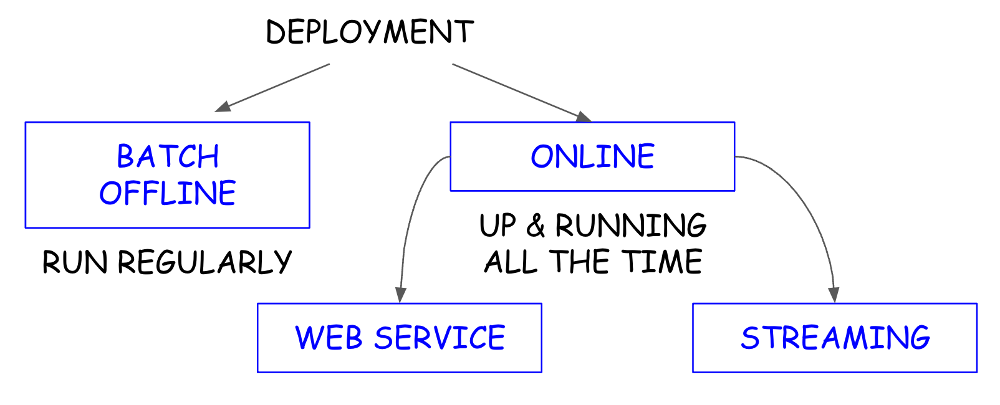
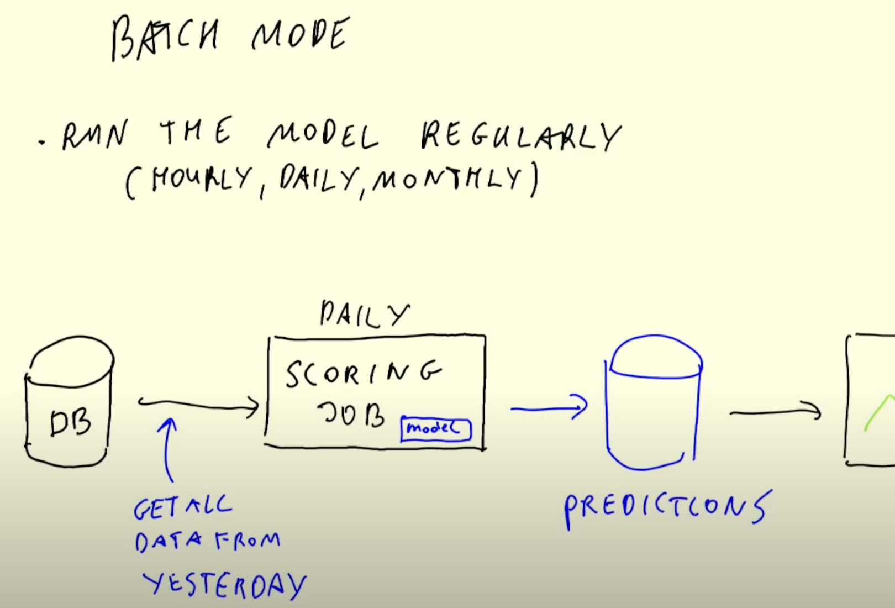
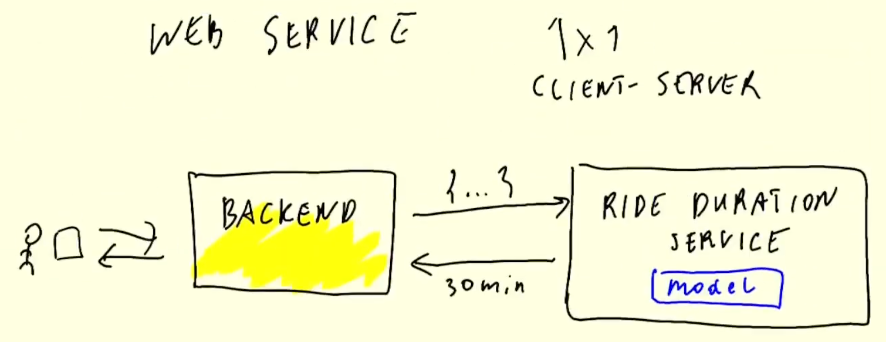
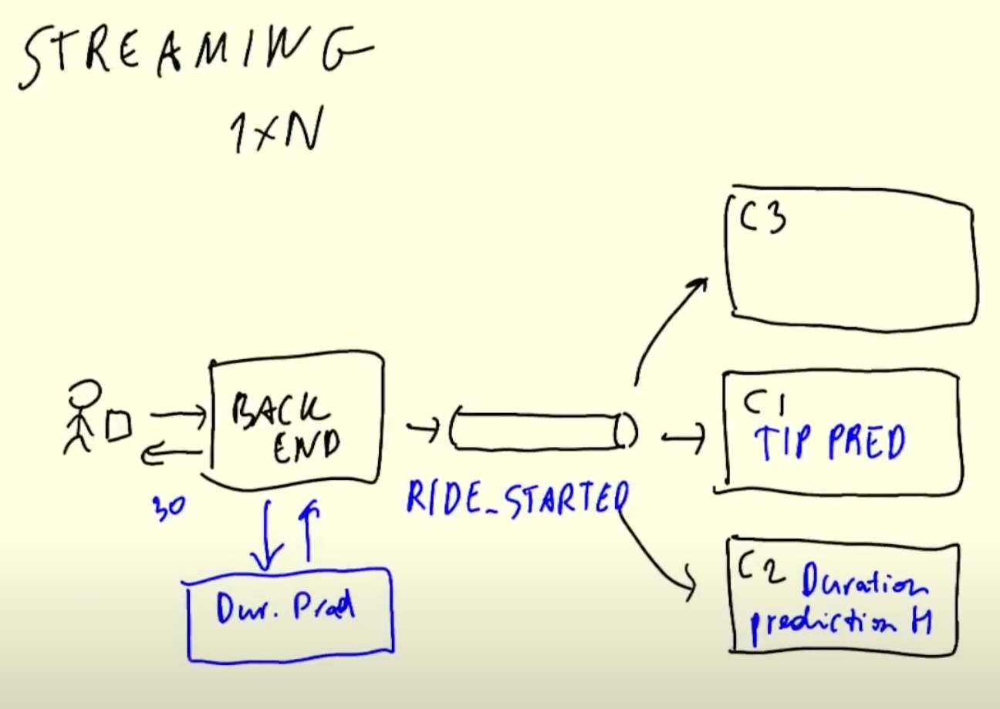
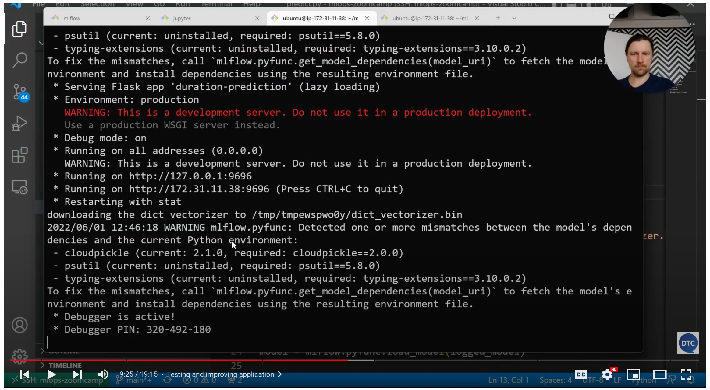

# 4. Model Deployment

See [GihHub page](https://github.com/DataTalksClub/mlops-zoomcamp/tree/main/04-deployment) 
for this section.

## 4.1 Three ways of deploying a model

:movie_camera: [Youtube](https://www.youtube.com/watch?v=JMGe4yIoBRA&list=PL3MmuxUbc_hIUISrluw_A7wDSmfOhErJK&index=22).

### MLOps: Design, Train, Experiment, Deploy

<table>
    <tr>
        <td>
            <b>Deployment</b><br>
            
        </td>
        <td>
            <b>Batch mode</b><br>
            
        </td>
    </tr>
    <tr>
        <td>
            <b>Web service</b><br>
            
        </td>
        <td>
            <b>Streaming</b><br>
            
        </td>
    </tr>
</table>

## 4.2 Web-services: Deploying models with Flask and Docker

:movie_camera: [Youtube](https://www.youtube.com/watch?v=D7wfMAdgdF8&list=PL3MmuxUbc_hIUISrluw_A7wDSmfOhErJK&index=23).

### Introduction

> [00:00](https://www.youtube.com/watch?v=D7wfMAdgdF8&list=PL3MmuxUbc_hIUISrluw_A7wDSmfOhErJK&index=23&t=0s) Introduction

In previous section, we created a pickle file with these instructions.

```python
with open('models/lin_reg.bin', 'wb') as f_out:
    pickle.dump((dv, lr), f_out)
```

Now we can take this pickle file and deploy this as a web application.

Gregory recommends viewing the videos linked to a ML Zoomcamp module (https://github.com/alexeygrigorev/mlbookcamp-code/tree/master/course-zoomcamp/05-deployment) before starting this section.
We will do something similar here in this section.

### Pipenv environment

> [01:41](https://www.youtube.com/watch?v=D7wfMAdgdF8&list=PL3MmuxUbc_hIUISrluw_A7wDSmfOhErJK&index=23&t=101s) Pipenv environment

We will create a virtual environment with [pipenv](https://pipenv.pypa.io/en/latest/), and then 
we will put our model in a script, put this script into [Flask](https://flask.palletsprojects.com/en/) application, 
and finnaly we will package everything in a [Docker](https://www.docker.com/).

We already have a model [here](https://github.com/DataTalksClub/mlops-zoomcamp/tree/main/04-deployment/web-service).

We need to find out the exact version of scikit-learn that we use for creating this pickle file.
If we try to unpickle with a different version of scikit-learn, it might not work.

The command `pip freeze` shows all the libraries that we currently have installed.

```bash
pip freeze | grep scikit-learn
```

We should see this.

```txt
scikit-learn==1.0.2
scikit-learn-intelex==2021.20210714.170444
```

We need to install with `pipenv`.

```bash
pipenv install scikit-learn==1.0.2 flask --python=3.9
```

This command will create a virtual environment and install the specified packages.
Enter this environment with the following command.

```bash
pipenv shell
```

You could change the prompt for one shorter with this command.

```bash
PS1="> "
```

You must have a `Pipfile` file that contains this.

```txt
[[source]]
url = "https://pypi.org/simple"
verify_ssl = true
name = "pypi"

[packages]
scikit-learn = "==1.0.2"
flask = "*"

[dev-packages]

[requires]
python_version = "3.9"
```

The `Pipfile.lock` file contains more precise information about the specific versions used of each 
of the libraries.

### Flask App

> [05:12](https://www.youtube.com/watch?v=D7wfMAdgdF8&list=PL3MmuxUbc_hIUISrluw_A7wDSmfOhErJK&index=23&t=312s) Flask App

Below, the [`predict.py`](https://raw.githubusercontent.com/DataTalksClub/mlops-zoomcamp/main/04-deployment/web-service/predict.py) script.

```python
import pickle

from flask import Flask, request, jsonify

with open('lin_reg.bin', 'rb') as f_in:
    (dv, model) = pickle.load(f_in)


def prepare_features(ride):
    features = {}
    features['PU_DO'] = '%s_%s' % (ride['PULocationID'], ride['DOLocationID'])
    features['trip_distance'] = ride['trip_distance']
    return features


def predict(features):
    X = dv.transform(features)
    preds = model.predict(X)
    return float(preds[0])


app = Flask('duration-prediction')


@app.route('/predict', methods=['POST'])
def predict_endpoint():
    ride = request.get_json()

    features = prepare_features(ride)
    pred = predict(features)

    result = {
        'duration': pred
    }

    return jsonify(result)


if __name__ == "__main__":
    app.run(debug=True, host='0.0.0.0', port=9696)
```

Now let's test that everything works.
See [`test.py`](https://github.com/DataTalksClub/mlops-zoomcamp/blob/main/04-deployment/web-service/test.py)

Test without Web request.

```python
import predict

ride = {
    "PULocationID": 10,
    "DOLocationID": 50,
    "trip_distance": 40
}

features = predict.prepare_features(ride)
pred = predict.predict(features)
print(pred[0])
```

Run the following and you should get the prediction.

```bash
python test.py
# 26.43883355119793
```

Test with Web request has a Flask application.

```python
import requests

ride = {
    "PULocationID": 10,
    "DOLocationID": 50,
    "trip_distance": 40
}

url = 'http://localhost:9696/predict'
response = requests.post(url, json=ride)
print(response.json())
```

Run the following and you should get the prediction.

```bash
python test.py
# {'duration': 26.43883355119793}
```

### gunicorn

> [16:23](https://www.youtube.com/watch?v=D7wfMAdgdF8&list=PL3MmuxUbc_hIUISrluw_A7wDSmfOhErJK&index=23&t=983s) gunicorn

We actually put our model in a Flask application and we can interact with it.
We can send ride information and get the prediction for this ride.

When we start our Flask application, we see this warning.

```txt
WARNING: This is a development server. Do not use it in a production deployment.
Use a production WSGI server instead.
```

To fix this warning, we need to use a production server like [gunicorn](https://gunicorn.org/).

```bash
# Install.
pipenv install gunicorn

# Start the application
gunicorn --bind:0.0.0.0:9696 predict:app
```

Open another terminal window and run the same test.

```bash
python test.py
# {'duration': 26.43883355119793}
```

### Pipenv --dev

> [17:52](https://www.youtube.com/watch?v=D7wfMAdgdF8&list=PL3MmuxUbc_hIUISrluw_A7wDSmfOhErJK&index=23&t=1072s) Pipenv --dev

The following commands do not work.

```bash
pipenv shell
python test.py
# ModuleNotFoundError: No module names 'requests'
```

We can install the requests library as a development dependency.
So only when we develop we will have this dependency but when we deploy this to production
this dependency will not be installed.

We can do this by using this command. Now, if we run the test, it will work.

```bash
pipenv install --dev requests
python test.py
# {'duration': 26.43883355119793}
```

### Docker

> [19:20](https://www.youtube.com/watch?v=D7wfMAdgdF8&list=PL3MmuxUbc_hIUISrluw_A7wDSmfOhErJK&index=23&t=1160s) Docker

Just one last thing is packaging the app to a docker container.

Create a [`Dockerfile`](https://github.com/DataTalksClub/mlops-zoomcamp/blob/main/04-deployment/web-service/Dockerfile) with this content.

```txt
FROM python:3.9.7-slim

RUN pip install -U pip
RUN pip install pipenv 

WORKDIR /app

COPY [ "Pipfile", "Pipfile.lock", "./" ]

RUN pipenv install --system --deploy

COPY [ "predict.py", "lin_reg.bin", "./" ]

EXPOSE 9696

ENTRYPOINT [ "gunicorn", "--bind=0.0.0.0:9696", "predict:app" ]
```

To build an image from a Dockerfile, run this.

```bash
docker build -t ride-duration-prediction-service:v1 .
```

To create and run a new container from the image, just run this.

```bash
docker run -it --rm -p 9696:9696 ride-duration-prediction-service:v1
```

See [docker build](https://docs.docker.com/engine/reference/commandline/build/)
and [docker run](https://docs.docker.com/engine/reference/commandline/run/) for more 
information.

See [Docker for beginners](https://docker-curriculum.com/), 
[Docker Guides](https://docs.docker.com/?utm_source=docker&utm_medium=inproductad&utm_campaign=20-11nurturecli_docs) and 
[How To Remove Docker Images, Containers, and Volumes](https://www.digitalocean.com/community/tutorials/how-to-remove-docker-images-containers-and-volumes).

## 4.3 Web-services: Getting the models from the model registry (MLflow)

:movie_camera: [Youtube](https://www.youtube.com/watch?v=aewOpHSCkqI&list=PL3MmuxUbc_hIUISrluw_A7wDSmfOhErJK&index=24).

### Introduction

> [00:00](https://www.youtube.com/watch?v=aewOpHSCkqI&list=PL3MmuxUbc_hIUISrluw_A7wDSmfOhErJK&index=24&t=0s) Introduction

We explain in this section how to deploy a model that comes from a model registry with Flask.

### Goal and required set-up

> [00:51](https://www.youtube.com/watch?v=aewOpHSCkqI&list=PL3MmuxUbc_hIUISrluw_A7wDSmfOhErJK&index=24&t=51s) Goal and required set-up

In this section, we will talk about combining what we did in the previous lesson 
deploying a model with a web service through Flask with our model registry.

See [`random-forest.ipynb`](https://github.com/DataTalksClub/mlops-zoomcamp/blob/main/04-deployment/web-service-mlflow/random-forest.ipynb).

```python
import pickle

import pandas as pd

from sklearn.feature_extraction import DictVectorizer
from sklearn.ensemble import RandomForestRegressor
from sklearn.metrics import mean_squared_error

from sklearn.pipeline import make_pipeline

import mlflow

mlflow.set_tracking_uri("http://127.0.0.1:5000")
mlflow.set_experiment("green-taxi-duration")

def read_dataframe(filename: str):
    df = pd.read_parquet(filename)

    df['duration'] = df.lpep_dropoff_datetime - df.lpep_pickup_datetime
    df.duration = df.duration.dt.total_seconds() / 60
    df = df[(df.duration >= 1) & (df.duration <= 60)]

    categorical = ['PULocationID', 'DOLocationID']
    df[categorical] = df[categorical].astype(str)
    return df


def prepare_dictionaries(df: pd.DataFrame):
    df['PU_DO'] = df['PULocationID'] + '_' + df['DOLocationID']
    categorical = ['PU_DO']
    numerical = ['trip_distance']
    dicts = df[categorical + numerical].to_dict(orient='records')
    return dicts

df_train = read_dataframe('data/green_tripdata_2021-01.parquet')
df_val = read_dataframe('data/green_tripdata_2021-02.parquet')

target = 'duration'
y_train = df_train[target].values
y_val = df_val[target].values

dict_train = prepare_dictionaries(df_train)
dict_val = prepare_dictionaries(df_val)

with mlflow.start_run():
    params = dict(max_depth=20, n_estimators=100, min_samples_leaf=10, random_state=0)
    mlflow.log_params(params)

    pipeline = make_pipeline(
        DictVectorizer(),
        RandomForestRegressor(**params, n_jobs=-1)
    )

    pipeline.fit(dict_train, y_train)
    y_pred = pipeline.predict(dict_val)

    rmse = mean_squared_error(y_pred, y_val, squared=False)
    print(params, rmse)
    # {'max_depth': 20, 'n_estimators': 100, 'min_samples_leaf': 10, 'random_state': 0} 15.136777093556063

    mlflow.log_metric('rmse', rmse)

    mlflow.sklearn.log_model(pipeline, artifact_path="model")

from mlflow.tracking import MlflowClient

MLFLOW_TRACKING_URI = 'http://127.0.0.1:5000'
RUN_ID = 'b4d3bca8aa8e46a6b8257fe4541b1136'

client = MlflowClient(tracking_uri=MLFLOW_TRACKING_URI)

path = client.download_artifacts(run_id=RUN_ID, path='dict_vectorizer.bin')

with open(path, 'rb') as f_out:
    dv = pickle.load(f_out)
```

> 01:31

The instructor starts mlflow with the following command.

```bash
mlflow server --backend-store-uri=sqlite:///mlflow.db --default-artifact-root=s3://mlflow-models-alexey/
```

### Writing Flask application with web-service mlflow

> [02:55](https://www.youtube.com/watch?v=aewOpHSCkqI&list=PL3MmuxUbc_hIUISrluw_A7wDSmfOhErJK&index=24&t=175s) Writing Flask application with web-service mlflow

To promote the model in production, we will use [`web-service-mlflow`](https://github.com/DataTalksClub/mlops-zoomcamp/tree/main/04-deployment/web-service-mlflow) folder.

Below, the `predict.py` script.

```python
import os
import pickle

import mlflow
from mlflow.tracking import mlflowClient

from flask import Flask, request, jsonify

MLFLOW_TRACKING_URI = 'http://127.0.0.1:5000'
RUN_ID = 'b4d3bca8aa8e46a6b8257fe4541b1136'

mflow.set_tracking_uri(MLFLOW_TRACKING_URI)
client = MlflowClient(tracking_uri=MLFLOW_TRACKING_URI)

path = client.download_artifacts(run_id=RUN_ID, path='dict_vectorizer.bin')
print(f'downloading the dict vectorizer to {path}')

with open(path, 'rb') as f_out:
    dv = pickle.load(f_out)

def prepare_features(ride):
    features = {}
    features['PU_DO'] = '%s_%s' % (ride['PULocationID'], ride['DOLocationID'])
    features['trip_distance'] = ride['trip_distance']
    return features


def predict(features):
    X = dv.transform(features)
    preds = model.predict(X)
    return float(preds[0])


app = Flask('duration-prediction')


@app.route('/predict', methods=['POST'])
def predict_endpoint():
    ride = request.get_json()

    features = prepare_features(ride)
    pred = predict(features)

    result = {
        'duration': pred,
        'model_version': RUN_ID
    }

    return jsonify(result)


if __name__ == "__main__":
    app.run(debug=True, host='0.0.0.0', port=9696)
```

### Testing and improving application

> [07:03](https://www.youtube.com/watch?v=aewOpHSCkqI&list=PL3MmuxUbc_hIUISrluw_A7wDSmfOhErJK&index=24&t=423s) Testing and improving application

Because we are in another directory (`04-deployment/web-service-mlflow/`), we need to create a new virtual environment and install libraries.

```bash
pipenv install mlflow
pipenv shell
pipenv install boto3
python predict.py
```

You should see something like this.



> 9:35

Now, run `python test.py` and the application should work.

```python
import requests

ride = {
    "PULocationID": 10,
    "DOLocationID": 50,
    "trip_distance": 40
}

url = 'http://localhost:9696/predict'
response = requests.post(url, json=ride)
print(response.json())
```

### Creating scikit-learn pipeline and logging it

> [10:10](https://www.youtube.com/watch?v=aewOpHSCkqI&list=PL3MmuxUbc_hIUISrluw_A7wDSmfOhErJK&index=24&t=610s) Creating scikit-learn pipeline and logging it

Below, an extract of [`random-forest.ipynb`](https://github.com/DataTalksClub/mlops-zoomcamp/blob/main/04-deployment/web-service-mlflow/random-forest.ipynb).

```python
from sklearn.pipeline import make_pipeline

with mlflow.start_run():
    params = dict(max_depth=20, n_estimators=100, min_samples_leaf=10, random_state=0)
    mlflow.log_params(params)

    pipeline = make_pipeline(
        DictVectorizer(),
        RandomForestRegressor(**params, n_jobs=-1)
    )

    pipeline.fit(dict_train, y_train)
    y_pred = pipeline.predict(dict_val)

    rmse = mean_squared_error(y_pred, y_val, squared=False)
    print(params, rmse)
    mlflow.log_metric('rmse', rmse)

    mlflow.sklearn.log_model(pipeline, artifact_path="model")
```

Now, we can simplify the `predict.py` script like this. We don't need `DictVectorizer` anymore.

```python
import os
import pickle

import mlflow
from flask import Flask, request, jsonify


RUN_ID = os.getenv('RUN_ID')

logged_model = f's3://mlflow-models-alexey/1/{RUN_ID}/artifacts/model'
# logged_model = f'runs:/{RUN_ID}/model'
model = mlflow.pyfunc.load_model(logged_model)


def prepare_features(ride):
    features = {}
    features['PU_DO'] = '%s_%s' % (ride['PULocationID'], ride['DOLocationID'])
    features['trip_distance'] = ride['trip_distance']
    return features


def predict(features):
    preds = model.predict(features)
    return float(preds[0])


app = Flask('duration-prediction')


@app.route('/predict', methods=['POST'])
def predict_endpoint():
    ride = request.get_json()

    features = prepare_features(ride)
    pred = predict(features)

    result = {
        'duration': pred,
        'model_version': RUN_ID
    }

    return jsonify(result)


if __name__ == "__main__":
    app.run(debug=True, host='0.0.0.0', port=9696)
```

You need to declare your `run id` with this command in the terminal.

```bash
export RUN_ID="b4d3bca8aa8e46a6b8257fe4541b1136"
```

### Why & how to become independent from the tracking server

> [14:44](https://www.youtube.com/watch?v=aewOpHSCkqI&list=PL3MmuxUbc_hIUISrluw_A7wDSmfOhErJK&index=24&t=884s) Why & how to become independent from the tracking server

In order not to depend on the MLflow tracking server (which can stop at any time), we can search for our model directly on S3.
See [mlflow.pyfunc.load_model](https://mlflow.org/docs/latest/python_api/mlflow.pyfunc.html#mlflow.pyfunc.load_model).

### Recap

> [18:27](https://www.youtube.com/watch?v=aewOpHSCkqI&list=PL3MmuxUbc_hIUISrluw_A7wDSmfOhErJK&index=24&t=1107s) Recap


## 4.4 (Optional) Streaming: Deploying models with Kinesis and Lambda

:movie_camera: [Youtube](https://www.youtube.com/watch?v=TCqr9HNcrsI&list=PL3MmuxUbc_hIUISrluw_A7wDSmfOhErJK&index=25).


## 4.5 Batch: Preparing a scoring script

:movie_camera: [Youtube](https://www.youtube.com/watch?v=18Lbaaeigek&list=PL3MmuxUbc_hIUISrluw_A7wDSmfOhErJK&index=26).

### Introduction and goal

> [00:00](https://www.youtube.com/watch?v=18Lbaaeigek&list=PL3MmuxUbc_hIUISrluw_A7wDSmfOhErJK&index=26&t=0s) Introduction and goal

In this section, we will cover :

* Turn the notebook for training a model into a notebook for applying the model
* Turn the notebook into a script
* Clean it and parametrize

### Turn previous training notebook into applying model notebook

> [02:00](https://www.youtube.com/watch?v=18Lbaaeigek&list=PL3MmuxUbc_hIUISrluw_A7wDSmfOhErJK&index=26&t=120s) Turn previous training notebook into applying model notebook

See [`score.ipynb`](https://github.com/DataTalksClub/mlops-zoomcamp/blob/main/04-deployment/batch/score.ipynb).

```python
import os
import uuid
import pickle

import pandas as pd

import mlflow

from sklearn.feature_extraction import DictVectorizer
from sklearn.ensemble import RandomForestRegressor
from sklearn.metrics import mean_squared_error
from sklearn.pipeline import make_pipeline


year = 2021
month = 2
taxi_type = 'green'

input_file = f'https://s3.amazonaws.com/nyc-tlc/trip+data/{taxi_type}_tripdata_{year:04d}-{month:02d}.parquet'
output_file = f'output/{taxi_type}/{year:04d}-{month:02d}.parquet'

RUN_ID = os.getenv('RUN_ID', 'e1efc53e9bd149078b0c12aeaa6365df')

# Generate unique number to identify (ride_id) each row in the dataframe.
def generate_uuids(n):
    ride_ids = []
    for i in range(n):
        ride_ids.append(str(uuid.uuid4()))
    return ride_ids

def read_dataframe(filename: str):
    df = pd.read_parquet(filename)

    df['duration'] = df.lpep_dropoff_datetime - df.lpep_pickup_datetime
    df.duration = df.duration.dt.total_seconds() / 60
    df = df[(df.duration >= 1) & (df.duration <= 60)]
    
    df['ride_id'] = generate_uuids(len(df))

    return df

def prepare_dictionaries(df: pd.DataFrame):
    categorical = ['PULocationID', 'DOLocationID']
    df[categorical] = df[categorical].astype(str)
    
    df['PU_DO'] = df['PULocationID'] + '_' + df['DOLocationID']

    categorical = ['PU_DO']
    numerical = ['trip_distance']
    dicts = df[categorical + numerical].to_dict(orient='records')
    return dicts

def load_model(run_id):
    logged_model = f's3://mlflow-models-alexey/1/{RUN_ID}/artifacts/model'
    model = mlflow.pyfunc.load_model(logged_model)
    return model

def apply_model(input_file, run_id, output_file):

    df = read_dataframe(input_file)
    dicts = prepare_dictionaries(df)

    model = load_model(run_id)
    y_pred = model.predict(dicts)

    df_result = pd.DataFrame()
    df_result['ride_id'] = df['ride_id']
    df_result['lpep_pickup_datetime'] = df['lpep_pickup_datetime']
    df_result['PULocationID'] = df['PULocationID']
    df_result['DOLocationID'] = df['DOLocationID']
    df_result['actual_duration'] = df['duration']
    df_result['predicted_duration'] = y_pred
    df_result['diff'] = df_result['actual_duration'] - df_result['predicted_duration']
    df_result['model_version'] = run_id
    
    df_result.to_parquet(output_file, index=False)

apply_model(input_file=input_file, run_id=RUN_ID, output_file=output_file)
```

### Turn notebook into a script

> [18:34](https://www.youtube.com/watch?v=18Lbaaeigek&list=PL3MmuxUbc_hIUISrluw_A7wDSmfOhErJK&index=26&t=1114s) Turn notebook into a script

To turn notbook into a script, we need first to run this command.

```bash
jupyter nbconvert --to script score.ipynb
```

See [`score.py`](https://github.com/DataTalksClub/mlops-zoomcamp/blob/main/04-deployment/batch/score.py).

```python
#!/usr/bin/env python
# coding: utf-8

import os
import sys

import uuid
import pickle

from datetime import datetime

import pandas as pd

import mlflow

from prefect import task, flow, get_run_logger
from prefect.context import get_run_context

from dateutil.relativedelta import relativedelta

from sklearn.feature_extraction import DictVectorizer
from sklearn.ensemble import RandomForestRegressor
from sklearn.metrics import mean_squared_error
from sklearn.pipeline import make_pipeline


def generate_uuids(n):
    ride_ids = []
    for i in range(n):
        ride_ids.append(str(uuid.uuid4()))
    return ride_ids


def read_dataframe(filename: str):
    df = pd.read_parquet(filename)

    df['duration'] = df.lpep_dropoff_datetime - df.lpep_pickup_datetime
    df.duration = df.duration.dt.total_seconds() / 60
    df = df[(df.duration >= 1) & (df.duration <= 60)]
    
    df['ride_id'] = generate_uuids(len(df))

    return df


def prepare_dictionaries(df: pd.DataFrame):
    categorical = ['PULocationID', 'DOLocationID']
    df[categorical] = df[categorical].astype(str)
    
    df['PU_DO'] = df['PULocationID'] + '_' + df['DOLocationID']

    categorical = ['PU_DO']
    numerical = ['trip_distance']
    dicts = df[categorical + numerical].to_dict(orient='records')
    return dicts


def load_model(run_id):
    logged_model = f's3://mlflow-models-alexey/1/{run_id}/artifacts/model'
    model = mlflow.pyfunc.load_model(logged_model)
    return model


def save_results(df, y_pred, run_id, output_file):
    df_result = pd.DataFrame()
    df_result['ride_id'] = df['ride_id']
    df_result['lpep_pickup_datetime'] = df['lpep_pickup_datetime']
    df_result['PULocationID'] = df['PULocationID']
    df_result['DOLocationID'] = df['DOLocationID']
    df_result['actual_duration'] = df['duration']
    df_result['predicted_duration'] = y_pred
    df_result['diff'] = df_result['actual_duration'] - df_result['predicted_duration']
    df_result['model_version'] = run_id

    df_result.to_parquet(output_file, index=False)


@task
def apply_model(input_file, run_id, output_file):
    logger = get_run_logger()

    logger.info(f'reading the data from {input_file}...')
    df = read_dataframe(input_file)
    dicts = prepare_dictionaries(df)

    logger.info(f'loading the model with RUN_ID={run_id}...')
    model = load_model(run_id)

    logger.info(f'applying the model...')
    y_pred = model.predict(dicts)

    logger.info(f'saving the result to {output_file}...')

    save_results(df, y_pred, run_id, output_file)
    return output_file


def get_paths(run_date, taxi_type, run_id):
    prev_month = run_date - relativedelta(months=1)
    year = prev_month.year
    month = prev_month.month 

    input_file = f's3://nyc-tlc/trip data/{taxi_type}_tripdata_{year:04d}-{month:02d}.parquet'
    output_file = f's3://nyc-duration-prediction-alexey/taxi_type={taxi_type}/year={year:04d}/month={month:02d}/{run_id}.parquet'

    return input_file, output_file


@flow
def ride_duration_prediction(
        taxi_type: str,
        run_id: str,
        run_date: datetime = None):
    if run_date is None:
        ctx = get_run_context()
        run_date = ctx.flow_run.expected_start_time
    
    input_file, output_file = get_paths(run_date, taxi_type, run_id)

    apply_model(
        input_file=input_file,
        run_id=run_id,
        output_file=output_file
    )


def run():
    taxi_type = sys.argv[1] # 'green'
    year = int(sys.argv[2]) # 2021
    month = int(sys.argv[3]) # 3

    run_id = sys.argv[4] # 'e1efc53e9bd149078b0c12aeaa6365df'

    ride_duration_prediction(
        taxi_type=taxi_type,
        run_id=run_id,
        run_date=datetime(year=year, month=month, day=1)
    )


if __name__ == '__main__':
    run()
```

Run this script with the following command.

```bash
python score.py green 2021 4 e1efc53e9bd149078b0c12aeaa6365df
```

### Tips for further improvements: Creating an environment and other options

> [24:16](https://www.youtube.com/watch?v=18Lbaaeigek&list=PL3MmuxUbc_hIUISrluw_A7wDSmfOhErJK&index=26&t=1456s) Tips for further improvements: Creating an environment and other options

## 4.6 MLOps Zoomcamp 4.6 - Batch: Scheduling batch scoring jobs with Prefect

:movie_camera: [Youtube](https://www.youtube.com/watch?v=ekT_JW213Tc&list=PL3MmuxUbc_hIUISrluw_A7wDSmfOhErJK&index=27).

### Intro

> [00:00](https://www.youtube.com/watch?v=ekT_JW213Tc&list=PL3MmuxUbc_hIUISrluw_A7wDSmfOhErJK&index=27&t=0s) Intro

### Prepare environment and modify script

> [00:35](https://www.youtube.com/watch?v=ekT_JW213Tc&list=PL3MmuxUbc_hIUISrluw_A7wDSmfOhErJK&index=27&t=35s) Prepare environment and modify script

```bash
pipenv --python=3.9 
pipenv install prefect==2.0b6 mlflow scikit-learn==1.0.2 pandas boto3 pyarrow s3fs
pipenv shell
prefect orion start
```

Note that [S3Fs](https://s3fs.readthedocs.io/en/latest/) is a Pythonic file interface to S3. 

Open [localhost:4200/runs](localhost:4200/runs).

In another terminal, run the following command.

```bash
pipenv shell
prefect config set PREFECT_API_URL=http://127.0.0.1:4200/api
python score.py green 2021 4 e1efc53e9bd149078b0c12aeaa6365df
```

### Change output file destination to S3

> [09:21](https://www.youtube.com/watch?v=ekT_JW213Tc&list=PL3MmuxUbc_hIUISrluw_A7wDSmfOhErJK&index=27&t=561s) Change output file destination to S3

### Turn script into proper Prefect flow

> [12:47](https://www.youtube.com/watch?v=ekT_JW213Tc&list=PL3MmuxUbc_hIUISrluw_A7wDSmfOhErJK&index=27&t=767s) Turn script into proper Prefect flow

### Deploy Prefect flow

> [16:39](https://www.youtube.com/watch?v=ekT_JW213Tc&list=PL3MmuxUbc_hIUISrluw_A7wDSmfOhErJK&index=27&t=999s) Deploy Prefect flow

See [score_deploy.py](https://github.com/DataTalksClub/mlops-zoomcamp/blob/main/04-deployment/batch/score_deploy.py).

```python
from prefect.deployments import Deployment
from prefect.orion.schemas.schedules import CronSchedule
from score import ride_duration_prediction

deployment = Deployment.build_from_flow(
    flow=ride_duration_prediction,
    name="ride_duration_prediction",
    parameters={
        "taxi_type": "green",
        "run_id": "e1efc53e9bd149078b0c12aeaa6365df",
    },
    schedule=CronSchedule(cron="0 3 2 * *"),
    work_queue_name="ml",
)

deployment.apply()
```

See [https://crontab.guru/#0_3_2_*_*](https://crontab.guru/#0_3_2_*_*) for the meaning of "0 3 2 * *".

See also [Deployments](https://docs.prefect.io/2.10.13/concepts/deployments/)

> 20:00

[Storage](https://orion-docs.prefect.io/concepts/storage/) saves your task results and deployments. Later when you run a deployment, Prefect will retrieve your flow from the storage.

To create storage, type:

```bash
prefect storage create
```

Select **Local Storage** and give the storage path `/home/ubuntu/mlops-zoomcamp/04-deployment/batch/tmp`.

### Apply model to previous months: Backfilling

> [23:24](https://www.youtube.com/watch?v=ekT_JW213Tc&list=PL3MmuxUbc_hIUISrluw_A7wDSmfOhErJK&index=27&t=1404s) Apply model to previous months: Backfilling

See [`score_backfill.py`](https://github.com/DataTalksClub/mlops-zoomcamp/blob/main/04-deployment/batch/score_backfill.py).

```python
from datetime import datetime
from dateutil.relativedelta import relativedelta

from prefect import flow

import score


@flow
def ride_duration_prediction_backfill():
    start_date = datetime(year=2021, month=3, day=1)
    end_date = datetime(year=2022, month=4, day=1)

    d = start_date

    while d <= end_date:
        score.ride_duration_prediction(
            taxi_type='green',
            run_id='e1efc53e9bd149078b0c12aeaa6365df',
            run_date=d
        )

        d = d + relativedelta(months=1)


if __name__ == '__main__':
    ride_duration_prediction_backfill()
```

### Recap

> [28:47](https://www.youtube.com/watch?v=ekT_JW213Tc&list=PL3MmuxUbc_hIUISrluw_A7wDSmfOhErJK&index=27&t=1727s) Recap


**Note**: There are several changes to deployment in Prefect 2.3.1 since 2.0b8:

* `DeploymentSpec` in 2.0b8 now becomes `Deployment`.
* `work_queue_name` is used instead of `tags` to submit the deployment to the a specific work queue.
* You don't need to create a work queue before using the work queue. A work queue will be created if it doesn't exist.
* `flow_location` is replaced with `flow`.
* `flow_runner` and `flow_storage` are no longer supported.

```python
from prefect.deployments import Deployment
from prefect.orion.schemas.schedules import CronSchedule
from score import ride_duration_prediction

deployment = Deployment.build_from_flow(
    flow=ride_duration_prediction,
    name="ride_duration_prediction",
    parameters={
        "taxi_type": "green",
        "run_id": "e1efc53e9bd149078b0c12aeaa6365df",
    },
    schedule=CronSchedule(cron="0 3 2 * *"),
    work_queue_name="ml",
)

deployment.apply()
```

## 4.7 Choosing the right way of deployment

:movie_camera: [Youtube]().

COMING SOON

## 4.8 Homework

