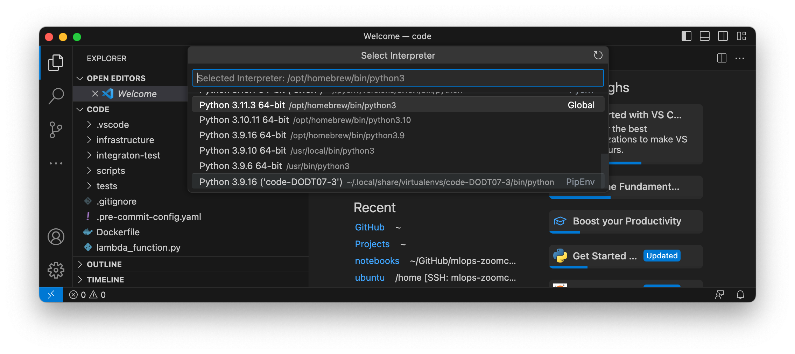
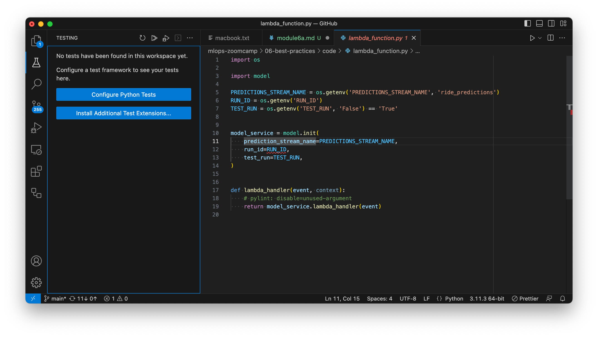
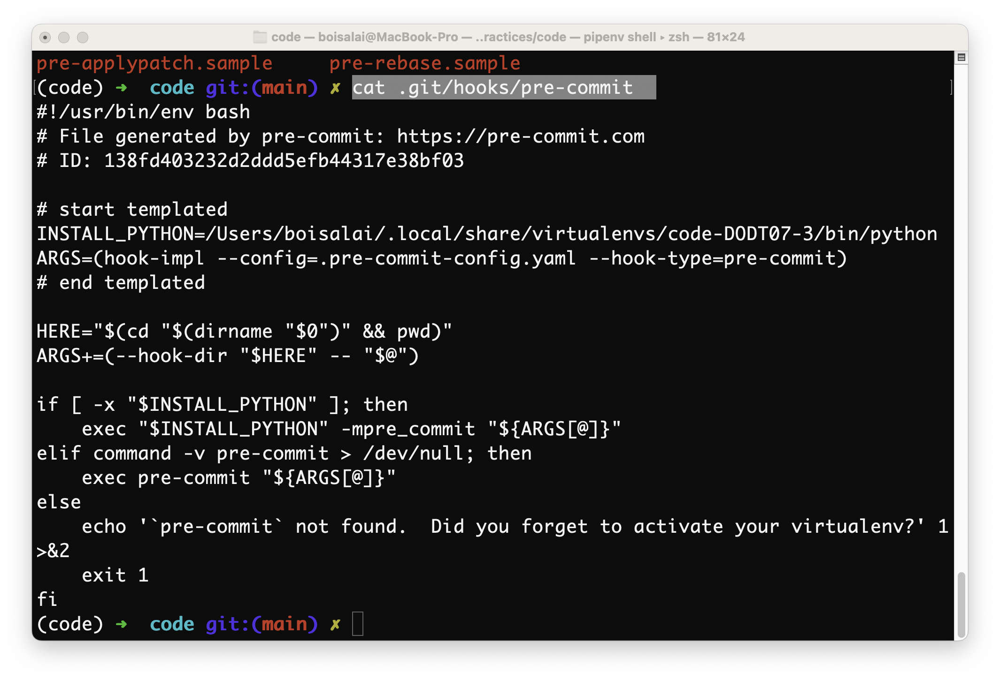
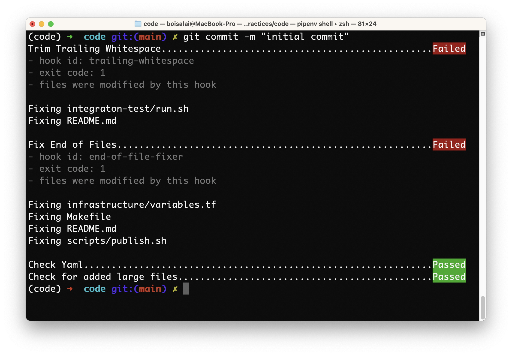
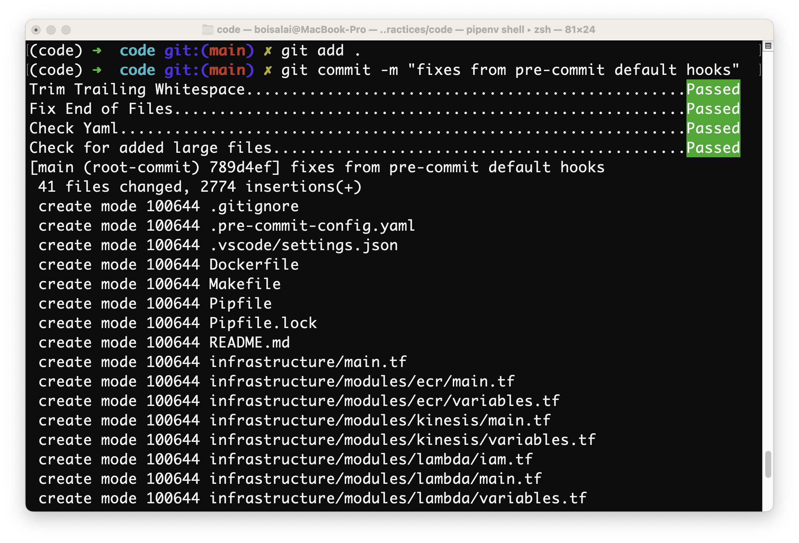

# 6A. Best Practices

In this module, we will see:

* Testing the code: unit tests with pytest
* Integration tests with Docker Compose
* Testing cloud services with LocalStack
* Code quality: linting and formatting
* Pre-commit hooks
* Makefiles

## 6A.1 Testing Python code with pytest

:movie_camera: [Youtube](https://www.youtube.com/watch?v=CJp1eFQP5nk&list=PL3MmuxUbc_hIUISrluw_A7wDSmfOhErJK)

### Introduction

> [00:00](https://www.youtube.com/watch?v=CJp1eFQP5nk&list=PL3MmuxUbc_hIUISrluw_A7wDSmfOhErJK&index=46&t=0s) Introduction

Best practices for Unit testing:

* Use many unit tests for smaller units
* Use Mocks

Integration tests are tests which cover the entire pipeline to assess how well the parts fit together.

### Set Up

> [01:51](https://www.youtube.com/watch?v=CJp1eFQP5nk&list=PL3MmuxUbc_hIUISrluw_A7wDSmfOhErJK&index=46&t=111s) Set Up

`Pipfile` contain information for the dependencies of the project, and supersedes the `requirements.txt` file used in most Python projects. 
You should add a `Pipfile` in the Git repository letting users who clone the repository know the only thing required would be installing 
`Pipenv` in the machine and typing pipenv install. `Pipenv` is a reference implementation for using `Pipfile`.

See [Basic Usage of Pipenv](https://pipenv-fork.readthedocs.io/en/latest/basics.html) for more information.

Here is our `Pipfile`.

```toml
[[source]]
url = "https://pypi.org/simple"
verify_ssl = true
name = "pypi"

[packages]
boto3 = "*"
mlflow = "*"
scikit-learn = "==1.0.2"

[dev-packages]
pytest = "*"
deepdiff = "*"
pylint = "==2.14.4"
black = "*"
isort = "*"
pre-commit = "*"

[requires]
python_version = "3.9"
```

Create the environment.

```bash
cd code
pipenv install 
```

Output virtualenv information.

```bash
pipenv --venv
# /Users/boisalai/.local/share/virtualenvs/code-DODT07-3
```

Open VSCode with `code .` from the same `code` folder.

```bash
cd code
code .
```

In VSCode, open the **Command Palette** (`Ctrl+Shift+P` on Windows or `Shift+Cmd+P` on macOS) and select  
**Python: Select Interpretor**. Choose the python interpreter corresponding to that of the pipenv environment.



```bash
which python
# python not found
which pytest
# /opt/homebrew/bin/pytest
pipenv shell
# Launching subshell in virtual environment...
#  . /Users/boisalai/.local/share/virtualenvs/code-DODT07-3/bin/activate
(code) which python
# /Users/boisalai/.local/share/virtualenvs/code-DODT07-3/bin/python
which pytest
# /opt/homebrew/bin/pytest
```

In VS Code, open `lambda_function.py` and click on **Testing** icon on the left menu. 
Click on **COnfigure Python Tests** button and select **pytest framnework**.



Select the directory containing the tests.

### Configure Python Tests

> [06:09](https://www.youtube.com/watch?v=CJp1eFQP5nk&list=PL3MmuxUbc_hIUISrluw_A7wDSmfOhErJK&index=46&t=369s) Configure Python Tests

See [`tests/model_test.py`](https://github.com/DataTalksClub/mlops-zoomcamp/blob/main/06-best-practices/code/tests/model_test.py).

Below `model_test.py`:

```python
from pathlib import Path

import model


def read_text(file):
    test_directory = Path(__file__).parent

    with open(test_directory / file, 'rt', encoding='utf-8') as f_in:
        return f_in.read().strip()


def test_base64_decode():
    base64_input = read_text('data.b64')

    actual_result = model.base64_decode(base64_input)
    expected_result = {
        "ride": {
            "PULocationID": 130,
            "DOLocationID": 205,
            "trip_distance": 3.66,
        },
        "ride_id": 256,
    }

    assert actual_result == expected_result


def test_prepare_features():
    model_service = model.ModelService(None)

    ride = {
        "PULocationID": 130,
        "DOLocationID": 205,
        "trip_distance": 3.66,
    }

    actual_features = model_service.prepare_features(ride)

    expected_fetures = {
        "PU_DO": "130_205",
        "trip_distance": 3.66,
    }

    assert actual_features == expected_fetures


class ModelMock:
    def __init__(self, value):
        self.value = value

    def predict(self, X):
        n = len(X)
        return [self.value] * n


def test_predict():
    model_mock = ModelMock(10.0)
    model_service = model.ModelService(model_mock)

    features = {
        "PU_DO": "130_205",
        "trip_distance": 3.66,
    }

    actual_prediction = model_service.predict(features)
    expected_prediction = 10.0

    assert actual_prediction == expected_prediction


def test_lambda_handler():
    model_mock = ModelMock(10.0)
    model_version = 'Test123'
    model_service = model.ModelService(model_mock, model_version)

    base64_input = read_text('data.b64')

    event = {
        "Records": [
            {
                "kinesis": {
                    "data": base64_input,
                },
            }
        ]
    }

    actual_predictions = model_service.lambda_handler(event)
    expected_predictions = {
        'predictions': [
            {
                'model': 'ride_duration_prediction_model',
                'version': model_version,
                'prediction': {
                    'ride_duration': 10.0,
                    'ride_id': 256,
                },
            }
        ]
    }

    assert actual_predictions == expected_predictions
```

Installing pytest as a dev dependency using pipenv:

```bash
pipenv install --dev pytest
```

Then create a directory where tests are stored in the current directory (Lambda/GCP Function Directory).
Example: `tests/` folder with an `__init__.py` file (could be empty).

Below, we install pytest with a Dockerfile.

```bash
FROM public.ecr.aws/lambda/python:3.9

RUN pip install -U pip
RUN pip install pipenv

COPY [ "Pipfile", "Pipfile.lock", "./" ]

RUN pipenv install --system --deploy

COPY [ "lambda_function.py", "model.py", "./" ]

CMD [ "lambda_function.lambda_handler" ]
```

```bash
docker build -t stream-model-duration:v2 .
```

```bash
docker run -it --rm \
    -p 8080:8080
    -e PREDICTIONS_STREAM_NAME="ride_predictions" \
    -e RUN_ID="eskjfhaskhadladgiaeopiawopfij" \
    -e TEST_RUN="True" \
    -e AWS_DEFAULT_REGION="eu-west-1" \
    stream-model-duration:v2
```

```bash
pipenv run pytest tests/
```

### Fixing lambda function

> [09:45](https://www.youtube.com/watch?v=CJp1eFQP5nk&list=PL3MmuxUbc_hIUISrluw_A7wDSmfOhErJK&index=46&t=585s) Fixing lambda function

### On docker

> [15:00](https://www.youtube.com/watch?v=CJp1eFQP5nk&list=PL3MmuxUbc_hIUISrluw_A7wDSmfOhErJK&index=46&t=900s) On docker

### Unit test test_base64_decode

> [18:09](https://www.youtube.com/watch?v=CJp1eFQP5nk&list=PL3MmuxUbc_hIUISrluw_A7wDSmfOhErJK&index=46&t=1089s) Unit test test_base64_decode

### Unit test test_predict

> [20:58](https://www.youtube.com/watch?v=CJp1eFQP5nk&list=PL3MmuxUbc_hIUISrluw_A7wDSmfOhErJK&index=46&t=1258s) Unit test test_predict

### Unit test test_lambda_handler

> [23:44](https://www.youtube.com/watch?v=CJp1eFQP5nk&list=PL3MmuxUbc_hIUISrluw_A7wDSmfOhErJK&index=46&t=1424s) Unit test test_lambda_handler

### Add callbacks (test_run)

> [26:18](https://www.youtube.com/watch?v=CJp1eFQP5nk&list=PL3MmuxUbc_hIUISrluw_A7wDSmfOhErJK&index=46&t=1578s) Add callbacks (test_run)

### Summary

> [30:44](https://www.youtube.com/watch?v=CJp1eFQP5nk&list=PL3MmuxUbc_hIUISrluw_A7wDSmfOhErJK&index=46&t=1844s) Summary

## 6A.2 Integration tests with docker-compose

:movie_camera: [Youtube](https://www.youtube.com/watch?v=lBX0Gl7Z1ck&list=PL3MmuxUbc_hIUISrluw_A7wDSmfOhErJK&index=47)

See [`integraton-test/test_docker.py`](https://github.com/DataTalksClub/mlops-zoomcamp/blob/main/06-best-practices/code/integraton-test/test_docker.py).

See [deepdiff](https://github.com/seperman/deepdiff).

```bash
pipenv install --dev deepdiff
```

> 20:13 

```bash
chmod +x integration-test/run.sh
```

The code below changes the current directory to the same one where the bash script is located.

```bash
cd "$(dirname "$0")"
``` 

> 24:29 

Install docker plugin on VS Code.

## 6A.3 Testing cloud services with LocalStack

:movie_camera: [Youtube](https://www.youtube.com/watch?v=9yMO86SYvuI&list=PL3MmuxUbc_hIUISrluw_A7wDSmfOhErJK&index=48)

We will use [LocalStack](https://github.com/localstack/localstack) that is a fully functional local AWS cloud stack. 
Develop and test your cloud & Serverless apps offline.

You can start LocalStack with [Docker Compose](https://docs.localstack.cloud/getting-started/installation/#docker-compose) by configuring a `docker-compose.yml` file. 

We can use [Kinesis](https://docs.localstack.cloud/user-guide/aws/kinesis/) with LocalStack.

> 3:00

```bash
docker-compose up kinesis
# List streams from AWS account.
aws kinesis list-streams
# List streams from LocalStack.
aws --endpoint-url=http://localhost:4566 kinesis list-streams
```

> 4:59

```bash
aws --endpoint-url=http://localhost:4566 kinesis create-stream help
aws --endpoint-url=http://localhost:4566 \
    kinesis create-stream \
    --stream-name ride_predictions \
    --shard-count 1
```

> 6:33 

See [`integraton-test/docker-compose.yaml`](https://github.com/DataTalksClub/mlops-zoomcamp/blob/main/06-best-practices/code/integraton-test/docker-compose.yaml).

## 6A.4 Code quality: linting and formatting

:movie_camera: [Youtube](https://www.youtube.com/watch?v=uImvWE-iSDQ&list=PL3MmuxUbc_hIUISrluw_A7wDSmfOhErJK&index=49)

See:

* [PEP 8 – Style Guide for Python Code](https://peps.python.org/pep-0008/)  is a document that provides guidelines and best practices on how to write Python code.
* [Pylint](https://github.com/pylint-dev/pylint) is a static code analysis tool for the Python programming language.
* [Pylint documentation](https://pylint.readthedocs.io/en/latest/)

```bash
pipenv install --dev pylint=2.17.4
```

We can create a `.pylintrc` file to disabled some warnings.

> 9:46

`pyproject.toml`

See [tests/model_test.py](06-best-practices/code/tests/model_test.py).

> 20:47 Black and isort

Avec Prefect, faire un git commit avant d'exécuter bl;ack and isort.
git commit -m ""

```bash
black --skip-string-normalization --diff . | less
black --skip-string-normalization
black .
```

See [`code/pyproject.toml`](https://github.com/DataTalksClub/mlops-zoomcamp/blob/main/06-best-practices/code/pyproject.toml)

> 27:56

```bash
pylint --recursive=y .
isort --help
isort diff . | less
isort .
```

> 31:47

Run the following commands in that order.

```bash
isort .
black .
pylint --recursive=y .
pytest tests/
```

After that, we can commit.

## 6A.5 Git pre-commit hooks

:movie_camera: [Youtube](https://www.youtube.com/watch?v=lmMZ7Axk2T8&list=PL3MmuxUbc_hIUISrluw_A7wDSmfOhErJK)

Without makefiles:

```bash
isort .
black .
pylint --recursive=y .
pytest tests/
```

[Git Hooks](https://git-scm.com/book/en/v2/Customizing-Git-Git-Hooks) are shell scripts found in the hidden `.git/hooks` 
directory of a Git repository. These scripts trigger actions in response to specific events, 
so they can help you automate your development lifecycle. 
Although you may never have noticed them, every Git repository includes sample scripts (in the `.git/hooks/` folder).

```bash
$ ls -la
$ cd .git
$ ls
FETCH_HEAD  config      hooks       info        logs        packed-refs
HEAD        description index       lfs         objects     refs
$ cd hooks
applypatch-msg.sample     post-merge                pre-push                  push-to-checkout.sample
commit-msg.sample         post-update.sample        pre-push.sample           update.sample
fsmonitor-watchman.sample pre-applypatch.sample     pre-rebase.sample
post-checkout             pre-commit.sample         pre-receive.sample
post-commit               pre-merge-commit.sample   prepare-commit-msg.sample
```

[pre-commit](https://pre-commit.com/) is a framework for managing and maintaining multi-language pre-commit hooks.

```bash
pwd
which python
pipenv install --dev pre-commit
```

> 0:02:51 - Run pre-commit hooks for specific folder.

Suppose we want pre-commit only for specific folder.

```bash
$ pwd
/Users/boisalai/github/mlops-zoomcamp/06-best-practices/code
$ git init
Initialized empty Git repository in /Users/boisalai/GitHub/mlops-zoomcamp/06-best-practices/code/.git/
$ ls -a
.                       Makefile                model.py
..                      Pipfile                 plan.md
.git                    Pipfile.lock            pyproject.toml
.gitignore              README.md               scripts
.pre-commit-config.yaml infrastructure          tests
.vscode                 integraton-test
Dockerfile              lambda_function.py
```

Create `.pre-commit-config.yaml` file.

```bash
$ pre-commit sample-config > .pre-commit-config.yaml
$ cat .pre-commit-config.yaml
# See https://pre-commit.com for more information
# See https://pre-commit.com/hooks.html for more hooks
repos:
-   repo: https://github.com/pre-commit/pre-commit-hooks
    rev: v3.2.0
    hooks:
    -   id: trailing-whitespace
    -   id: end-of-file-fixer
    -   id: check-yaml
    -   id: check-added-large-files
```

Run `pre-commit install` to install pre-commit into your git hooks.

```bash
$ pre-commit install
pre-commit installed at .git/hooks/pre-commit
$ ls .git/hooks/
applypatch-msg.sample     pre-commit                pre-receive.sample
commit-msg.sample         pre-commit.sample         prepare-commit-msg.sample
fsmonitor-watchman.sample pre-merge-commit.sample   push-to-checkout.sample
post-update.sample        pre-push.sample           update.sample
pre-applypatch.sample     pre-rebase.sample
$ cat .git/hooks/pre-commit  
```

You should see this.



Create `.gitignore` file with this content.

```bash
__pycache__
```

After run the following commands.

```bash
$ git status
$ git add .
$ git commit -m "initial commit"
```

You should see this.



Run the following commands to see what has changed.

```bash
$ git status
$ git diff
```

After, run the following commands.

```bash
$ git add .
$ git commit -m "fixes from pre-commit default hooks"
```

You should see this.



See https://pre-commit.com/hooks.html for more hooks. For example `detect-private-key` detects the presence of private keys.

See also [Using isort with pre-commit](https://pycqa.github.io/isort/docs/configuration/pre-commit.html).

To use isort's official pre-commit integration add the following config to the `.pre-commit-config.yaml` file.

```yaml
# See https://pre-commit.com for more information
# See https://pre-commit.com/hooks.html for more hooks
repos:
- repo: https://github.com/pre-commit/pre-commit-hooks
  rev: v3.2.0
  hooks:
    - id: trailing-whitespace
    - id: end-of-file-fixer
    - id: check-yaml
    - id: check-added-large-files
- repo: https://github.com/pycqa/isort
  rev: 5.11.2
  hooks:
    - id: isort
      name: isort (python)
```

Let's see what this thing will do.

```bash
$ git add .pre-commit-config.yaml
$ git commit -m "test"
```

We can also add [black pre-commit](https://black.readthedocs.io/en/stable/integrations/source_version_control.html).

```yaml
repos:
  - repo: https://github.com/psf/black
    rev: 22.6.0
    hooks:
      - id: black
        language_version: python3.9
```

We can also add [pylint pre-commit](https://pylint.pycqa.org/en/latest/user_guide/installation/pre-commit-integration.html).

```yaml
- repo: local
  hooks:
    - id: pylint
      name: pylint
      entry: pylint
      language: system
      types: [python]
      args: [
        "-rn", # Only display messages
        "-sn", # Don't display the score
        "--recursive=y",
      ]
```

We can also add [pytest pre-commit](https://stackoverflow.com/questions/64011304/running-pytest-as-a-pre-commit-hook-no-such-file-or-directory-issue).

```yaml
- repo: local
  hooks:
    - id: pytest-check
      name: pytest-check
      entry: pytest
      language: system
      pass_filenames: false
      always_run: true
      args: [
        "tests/"
      ]
```

Let's see what these things will do.

```bash
$ git add .pre-commit-config.yaml
$ git commit -m "test"
```

To recap, run the following commands.

```bash
$ rm -rf .git
$ git init
Initialized empty Git repository in /Users/boisalai/GitHub/mlops-zoomcamp/06-best-practices/code/.git/
$ pre-commit install
pre-commit installed at .git/hooks/pre-commit
$ git add .
$ git commit -m "initial commit"
```

Unfortunately, I get this message "RuntimeError: The Poetry configuration is invalid:".
I will correct this later.

Before finish, make sure this delete `.git` folder.

```bash
$ rm -rf .git
```

## 6A.6 Makefiles and make

:movie_camera: [Youtube](https://www.youtube.com/watch?v=F6DZdvbRZQQ&list=PL3MmuxUbc_hIUISrluw_A7wDSmfOhErJK&index=51)

To install `make` on Linux:

```bash
$ sudo apt install make
```

This tool is already installed on my MacBook Pro M1.

See [GNU make documentation](https://www.gnu.org/software/make/manual/html_node/index.html) and [Makefile Tutorial](https://makefiletutorial.com/).

A simple makefile consists of "rules" with the following shape:

```yaml
target ... : prerequisites ...
    recipe
    ...
    ...
```
  
A **target** is usually the name of a file that is generated by a program; examples of targets are executable or object files. 
A target can also be the name of an action to carry out, such as "clean".

A **prerequisite** is a file that is used as input to create the target. A target often depends on several files.

A **recipe** is an action that make carries out. A recipe may have more than one command, either on the same line or each on its own line.


Let's start with the simplest of Makefiles:

```yaml
hello:
    echo "Hello, World"
```

Note: Makefiles must be indented using TABs and not spaces or make will fail.

Here is the output of running the above example:

```bash
$ make
echo "Hello, World"
Hello, World
```

See [06-best-practices/code/Makefile](https://github.com/DataTalksClub/mlops-zoomcamp/blob/main/06-best-practices/code/Makefile) from MLOps Zoomcamp repo.

```yaml
LOCAL_TAG:=$(shell date +"%Y-%m-%d-%H-%M-%S")
LOCAL_IMAGE_NAME:=stream-model-duration:${LOCAL_TAG}

test:
  pytest tests/

quality_checks:
  isort .
  black .
  pylint --recursive=y .

build: quality_checks test
  docker build -t ${LOCAL_IMAGE_NAME} .

integration_test: build
  LOCAL_IMAGE_NAME=${LOCAL_IMAGE_NAME} bash integraton-test/run.sh

publish: build integration_test
  LOCAL_IMAGE_NAME=${LOCAL_IMAGE_NAME} bash scripts/publish.sh

setup:
  pipenv install --dev
  pre-commit install
```

```bash
$ make setup
$ make test
$ make publish
```

Below, the [06-best-practices/code/integraton-test/run.sh](https://github.com/DataTalksClub/mlops-zoomcamp/blob/main/06-best-practices/code/integraton-test/run.sh) file
for integration test.

```bash
#!/usr/bin/env bash

if [[ -z "${GITHUB_ACTIONS}" ]]; then
  cd "$(dirname "$0")"
fi

if [ "${LOCAL_IMAGE_NAME}" == "" ]; then 
    LOCAL_TAG=`date +"%Y-%m-%d-%H-%M"`
    export LOCAL_IMAGE_NAME="stream-model-duration:${LOCAL_TAG}"
    echo "LOCAL_IMAGE_NAME is not set, building a new image with tag ${LOCAL_IMAGE_NAME}"
    docker build -t ${LOCAL_IMAGE_NAME} ..
else
    echo "no need to build image ${LOCAL_IMAGE_NAME}"
fi

export PREDICTIONS_STREAM_NAME="ride_predictions"

docker-compose up -d

sleep 5

aws --endpoint-url=http://localhost:4566 \
    kinesis create-stream \
    --stream-name ${PREDICTIONS_STREAM_NAME} \
    --shard-count 1

pipenv run python test_docker.py

ERROR_CODE=$?

if [ ${ERROR_CODE} != 0 ]; then
    docker-compose logs
    docker-compose down
    exit ${ERROR_CODE}
fi


pipenv run python test_kinesis.py

ERROR_CODE=$?

if [ ${ERROR_CODE} != 0 ]; then
    docker-compose logs
    docker-compose down
    exit ${ERROR_CODE}
fi


docker-compose down
```

Below, the [06-best-practices/code/scripts/publish.sh](https://github.com/DataTalksClub/mlops-zoomcamp/blob/main/06-best-practices/code/scripts/publish.sh).

```bash
#!/usr/bin/env bash

echo "publishing image ${LOCAL_IMAGE_NAME} to ECR..."
```

See below some interesting Makefile examples

* https://gist.github.com/DerekV/3030284
* https://chromium.googlesource.com/external/github.com/Masterminds/glide/+/refs/tags/0.9.1/Makefile

## 6A.7 Homework

See [Homework](notebooks/homework-6/homework.md)