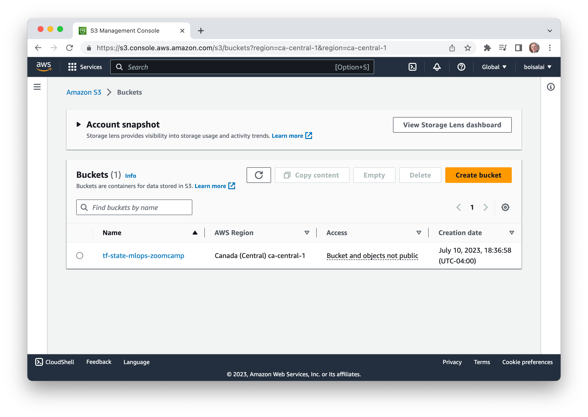
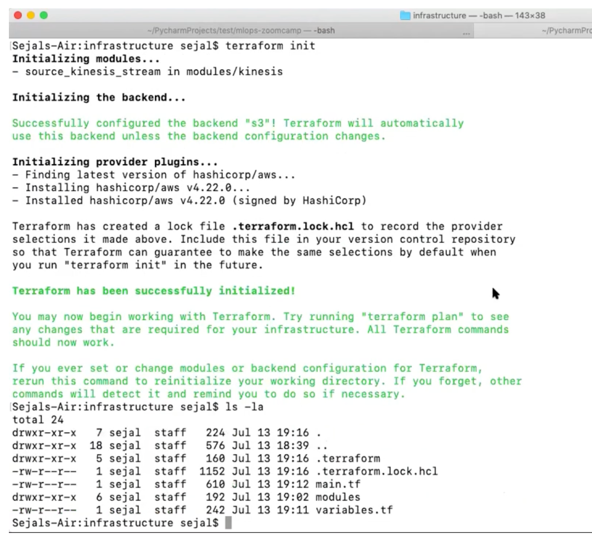

# 6B. Infrastructure-as-Code with Terraform and CI/CD with GitHub Actions

## Infrastructure-as-Code with Terraform


Summary:

* Setting up a stream-based pipeline infrastructure in AWS, using Terraform
* Project infrastructure modules (AWS): Kinesis Streams (Producer & Consumer), Lambda (Serving API), S3 Bucket (Model artifacts), ECR (Image Registry)

Further info here:

* [Concepts of IaC and Terraform](https://github.com/DataTalksClub/mlops-zoomcamp/blob/main/06-best-practices/docs.md#concepts-of-iac-and-terraform)
* [Setup and Execution](https://github.com/DataTalksClub/mlops-zoomcamp/tree/main/06-best-practices/code#iac)

### 6B.1 Terraform - Introduction

:movie_camera: [Youtube](https://www.youtube.com/watch?v=zRcLgT7Qnio&list=PL3MmuxUbc_hIUISrluw_A7wDSmfOhErJK&index=49)

Summary:

* Introduction
* Setup & Pre-Reqs
* Concepts of Terraform and IaC (reference material from previous courses)

#### Set up infrastructure for stream-based pipeline in AWS

> [00:00](https://www.youtube.com/watch?v=zRcLgT7Qnio&list=PL3MmuxUbc_hIUISrluw_A7wDSmfOhErJK&index=52&t=0s) - Set up infrastructure for stream-based pipeline in AWS.

We have:

* a set of Kinesis streams both on the producer and the consumer side
* a Lambda for our prediction service
* a S3 bucket for our model artifect
* a EC repository (ECR) for holding the docker image for the container
* a Cloud Watch (CW) event that would trigger this particulier Lambda one you know event arrives in the gaming stream.

#### Trigger camera on gaming stream events

> [00:42](https://www.youtube.com/watch?v=zRcLgT7Qnio&list=PL3MmuxUbc_hIUISrluw_A7wDSmfOhErJK&index=52&t=42s) - Trigger camera on gaming stream events.

The workflow is the right events will arrive to your source stream in AWS Kinesis and as when these events come 
to this stream the event processor Lambda gets triggered à. This Lambda then reads records 
from the Kinesis input stream and uses the model from the artifacts bucket in S3
to generate predictions per event. Finally these prediction events then get published to your Kinesis output stream after successful 
processing.

#### Prerequisites and setup for AWS client

> [01:27](https://www.youtube.com/watch?v=zRcLgT7Qnio&list=PL3MmuxUbc_hIUISrluw_A7wDSmfOhErJK&index=52&t=87s) - Prerequisites and setup for AWS client.

#### Install, configure, and check version of AWS secret key

> [02:23](https://www.youtube.com/watch?v=zRcLgT7Qnio&list=PL3MmuxUbc_hIUISrluw_A7wDSmfOhErJK&index=52&t=143s) - Install, configure, and check version of AWS secret key.

See [instructions](https://docs.aws.amazon.com/cli/latest/userguide/getting-started-prereqs.html) to create an AWS account, head to the IAM section, 
generate your secret-key, and download it locally. 

* Go to [AWS Management Console](https://aws.amazon.com/console/).
* Go to **IAM** section.
* From the **IAM dashboard**, click on **Users**.
* Select a user (I select **mlops-zoom-user**).
* Select **Security credentials** tab.
* Click on **Create access key** button.

Keep your keys (`Access key: AKIAXXXXXXXXXX` and `Secret access key: YwQiRXxxxxxxxxxxxxxxxxxxxx`) in a secret place.

Download [`aws-cli`](https://docs.aws.amazon.com/cli/latest/userguide/getting-started-install.html) as a tool to use on your terminal.

Check installation (I'm using macOS on MacBook M1).

```bash
$ which aws
/usr/local/bin/aws
$ aws --version
aws-cli/2.13.0 Python/3.11.4 Darwin/22.5.0 exe/x86_64 prompt/off
```

Configure `aws-cli` with your downloaded AWS secret keys:

```bash
$ aws configure
AWS Access Key ID [None]: AKIAXXXXXXXXXX
AWS Secret Access Key [None]: YwQiRXxxxxxxxxxxxxxxxxxxxx
Default region name [None]: ca-central-1
Default output format [None]:
```

Verify aws config:

```bash
$ aws sts get-caller-identity
```

#### Configure infra code with Terraform

> [03:35](https://www.youtube.com/watch?v=zRcLgT7Qnio&list=PL3MmuxUbc_hIUISrluw_A7wDSmfOhErJK&index=52&t=215s) - Configure infra code with Terraform.

#### Learn data engineering basics with Zoomcamp

> [04:23](https://www.youtube.com/watch?v=zRcLgT7Qnio&list=PL3MmuxUbc_hIUISrluw_A7wDSmfOhErJK&index=52&t=263s) - Learn data engineering basics with Zoom Camp.

See [here](https://github.com/sejalv/mlops-zoomcamp/tree/develop/06-best-practices#concepts-of-terraform-and-iac) for concepts of Terraform and IaC from
previous videos.

#### Setting up stream-based AWS pipeline with Terraform

> [05:14](https://www.youtube.com/watch?v=zRcLgT7Qnio&list=PL3MmuxUbc_hIUISrluw_A7wDSmfOhErJK&index=52&t=314s) - Setting up stream-based AWS pipeline with Terraform.

#### Deploying & automating Terraform w/ CI/CD

> [06:11](https://www.youtube.com/watch?v=zRcLgT7Qnio&list=PL3MmuxUbc_hIUISrluw_A7wDSmfOhErJK&index=52&t=371s) - Deploying & automating Terraform w/ CI/CD.

Install Terraform (I'm using macOS). See instructions [here](https://developer.hashicorp.com/terraform/downloads) for your OS.
See also [Install Terraform](https://developer.hashicorp.com/terraform/tutorials/aws-get-started/install-cli).

```bash
$ brew tap hashicorp/tap
$ brew install hashicorp/tap/terraform
$ terraform --version
Terraform v1.5.2
on darwin_arm64
```

### 6B.2: Terraform - Modules and Outputs variables

:movie_camera: [Youtube](https://www.youtube.com/watch?v=-6scXrFcPNk&list=PL3MmuxUbc_hIUISrluw_A7wDSmfOhErJK&index=53)

A [module](https://developer.hashicorp.com/terraform/language/modules/develop) is a container for multiple resources that are used together. 
You can use modules to create lightweight abstractions, so that you can describe your infrastructure in terms of its architecture, 
rather than directly in terms of physical objects.

We create a new folder called [06-best-practices/code/infrastructure](https://github.com/sejalv/mlops-zoomcamp/tree/develop/06-best-practices/code/infrastructure)
with two files `main.tf` and `variables.tf`. 

Below, the `main.tf` file.

```hcl
# Make sure to create state bucket beforehand
terraform {
  required_version = ">= 1.0"
  backend "s3" {
    bucket  = "tf-state-mlops-zoomcamp"
    key     = "mlops-zoomcamp.tfstate"
    region  = var.aws_region
    encrypt = true
  }
}

provider "aws" {
  region = var.aws_region
}

data "aws_caller_identity" "current_identity" {}

locals {
  account_id = data.aws_caller_identity.current_identity.account_id
}

module "ecr_image" {
  source = "./modules/ecr"
  ecr_repo_name = "${var.ecr_repo_name}_${var.project_id}"
  account_id = local.account_id
  lambda_function_local_path = var.lambda_function_local_path
  docker_image_local_path = var.docker_image_local_path
}

module "source_kinesis_stream" {
  source           = "./modules/kinesis"
  stream_name      = "${var.source_stream_name}_${var.project_id}"
  retention_period = 48
  shard_count      = 2
  tags             = var.project_id
}

module "output_kinesis_stream" {
  source           = "./modules/kinesis"
  stream_name      = "${var.output_kinesis_stream}_${var.project_id}"
  retention_period = 48
  shard_count      = 2
  tags           = var.project_id
}

module "s3_bucket" {
  source = "./modules/s3"
  bucket_name = "${var.model_bucket}-${var.project_id}"
}

module "lambda_function" {
  source                  = "./modules/lambda"
  lambda_function_name    = "${var.lambda_function_name}_${var.project_id}"
  image_uri               = module.ecr_image.image_uri
  source_stream_name      = "${var.source_stream_name}_${var.project_id}"
  source_stream_arn       = module.source_kinesis_stream.stream_arn
  output_stream_name      = "${var.output_kinesis_stream}_${var.project_id}"
  output_stream_arn       = module.output_kinesis_stream.stream_arn
  model_bucket            = module.s3_bucket.name
}

# For CI/CD
output "lambda_function" {
  value     = "${var.lambda_function_name}_${var.project_id}"
}

output "model_bucket" {
  value     = module.s3_bucket.name
}

output "predictions_stream_name" {
  value     = "${var.output_kinesis_stream}_${var.project_id}"
}

output "ecr_repo" {
  value = "${var.ecr_repo_name}_${var.project_id}"
}
```

Below, the `variables.tf` file.

```hcl
variable "aws_region" {
  description = "AWS region to create resources"
  default     = "ca-central-1"
}

variable "project_id" {
  description = "project_id"
  default = "mlops-zoomcamp"
}

variable "lambda_function_local_path" {
  description = ""
}

variable "docker_image_local_path" {
  description = ""
}

variable "ecr_repo_name" {
  description = ""
}

variable "lambda_function_name" {
  description = ""
}

variable "model_bucket" {
  description = ""
}

variable "source_stream_name" {
  description = ""
}

 variable "output_kinesis_stream"{
   description=""
}
```

For each module `./modules/ecr`, `./modules/kinesis`, `./modules/s3` and `./modules/lambda`, we have a `main.tf` and `vars.tf` files.
See [here](https://github.com/sejalv/mlops-zoomcamp/tree/develop/06-best-practices/code/infrastructure/modules).

> [0:05:38](https://www.youtube.com/watch?v=-6scXrFcPNk&list=PL3MmuxUbc_hIUISrluw_A7wDSmfOhErJK&index=53&t=338s) - Create state bucket manually.

We must create S3 bucket manually before running terraform commands.

* Go to [AWS Management Console](https://aws.amazon.com/console/).
* Go to **S3** section.
* Click on **Create bucket** button.
* Give a name to the bucket, for example `tf-state-mlops-zoomcamp`.
* Select a region (mine is `ca-central-1`).
* Click on **Create bucket** button.

You should have this.

<table>
    <tr>
        <td>
            
        </td>
        <td>
            
        </td>
    </tr>
</table>

> [0:27:00](https://www.youtube.com/watch?v=-6scXrFcPNk&list=PL3MmuxUbc_hIUISrluw_A7wDSmfOhErJK&index=53&t=1620s) - Run terraform init in week 6 best practices.

```bash
$ pwd
.../mlops-zoomcamp/06-best-practices/code/infrastructure
$ ls -la
total 16
drwxr-xr-x   6 boisalai  staff   192 10 Jul 08:14 .
drwxr-xr-x  18 boisalai  staff   576 10 Jul 08:14 ..
-rw-r--r--@  1 boisalai  staff  2051 10 Jul 18:51 main.tf
drwxr-xr-x   6 boisalai  staff   192 10 Jul 08:14 modules
-rw-r--r--   1 boisalai  staff   578 10 Jul 08:14 variables.tf
drwxr-xr-x   4 boisalai  staff   128 10 Jul 08:14 vars
$ terraform init
```

You should see something like this.



The [`terraform plan`](https://developer.hashicorp.com/terraform/cli/commands/plan) 
command creates an execution plan, which lets you preview the changes that Terraform plans to make to your infrastructure.

```bash
$ terraform plan
```

The [`terraform apply`](https://developer.hashicorp.com/terraform/cli/commands/apply) command executes the actions proposed in a Terraform plan.

```bash
$ terraform apply
```

The [`terraform destroy`](https://developer.hashicorp.com/terraform/cli/commands/destroy) 
command is a convenient way to destroy all remote objects managed by a particular Terraform configuration.

Run `terraform destroy` when you don't need these resources.

```bash
$ terraform destroy
```

If you go to the **Amazon Kinesis** Dashboard, you should see your data streams created.

### 6B.3: Build an e2e workflow for Ride Predictions

:movie_camera: [Youtube](https://www.youtube.com/watch?v=JVydd1K6R7M&list=PL3MmuxUbc_hIUISrluw_A7wDSmfOhErJK&index=54)

In the last video, we learned:

* how to set up terraform with minimal configuration
* how to build some basic required blocks for our project
* how to create a custom module
* generate a Kinesis stream with it on AWS.

In this video, we will finish setting up the rest of the pipeline that is configure S3, Lambda and ECR.

> [0:00:51](https://www.youtube.com/watch?v=JVydd1K6R7M&list=PL3MmuxUbc_hIUISrluw_A7wDSmfOhErJK&index=54&t=51s) - Creating two Kinesis streams.

Below, an extracted from `infrastructure/main.tf` file.

```hcl
# ride_events
module "source_kinesis_stream" {
  source           = "./modules/kinesis"
  stream_name      = "${var.source_stream_name}_${var.project_id}"
  retention_period = 48
  shard_count      = 2
  tags             = var.project_id
}

# ride_prediction
module "output_kinesis_stream" {
  source           = "./modules/kinesis"
  stream_name      = "${var.output_kinesis_stream}_${var.project_id}"
  retention_period = 48
  shard_count      = 2
  tags           = var.project_id
}
```

Below, the `infrastructure/modules/kinesis/main.tf` file.

```hcl
# Create Kinesis Data Stream

resource "aws_kinesis_stream" "stream" {
  name             = var.stream_name
  shard_count      = var.shard_count
  retention_period = var.retention_period
  shard_level_metrics = var.shard_level_metrics
  tags = {
    CreatedBy = var.tags
  }
}
```

See also `infrastructure/modules/kinesis/vars.tf` and `infrastructure/modules/kinesis/output.tf` files.

> [0:02:14](https://www.youtube.com/watch?v=JVydd1K6R7M&list=PL3MmuxUbc_hIUISrluw_A7wDSmfOhErJK&index=54&t=134s) - Create S3 bucket for model artifacts.

Below, an extracted from `infrastructure/main.tf` file.

```hcl
module "s3_bucket" {
  source = "./modules/s3"
  bucket_name = "${var.model_bucket}-${var.project_id}"
}
```

Below, the `infrastructure/modules/s3/main.tf` file.

```hcl
resource "aws_s3_bucket" "s3_bucket" {
  bucket = var.bucket_name
  acl    = "private"
}

output "name" {
  value = aws_s3_bucket.s3_bucket.bucket
}
```

See also `infrastructure/modules/s3/vars.tf` file.

See video for trickiers parts (ECR and Lamda) between 14:00 and 54:00.

> [0:54:54](https://www.youtube.com/watch?v=JVydd1K6R7M&list=PL3MmuxUbc_hIUISrluw_A7wDSmfOhErJK&index=54&t=3294s) - Model versioning with MLFlow.

Sorry. I'll stop this video here and maybe I'll come back later.

### 6B.4: Test the pipeline e2e

:movie_camera: [Youtube](https://www.youtube.com/watch?v=YWao0rnqVoI&list=PL3MmuxUbc_hIUISrluw_A7wDSmfOhErJK&index=55)

* Demo: apply TF to our use-case, manually deploy data dependencies & test
* Recap: IaC, Terraform, next steps

Additional material on understanding Terraform concepts here: [Reference Material](https://github.com/DataTalksClub/mlops-zoomcamp/blob/main/06-best-practices/docs.md#concepts-of-iac-and-terraform)

## CI/CD with GitHub Actions


Summary:

* Automate a complete CI/CD pipeline using GitHub Actions to automatically trigger jobs to build, test, and deploy our service to Lambda for every new commit/code change to our repository.
* The goal of our CI/CD pipeline is to execute tests, build and push container image to a registry, and update our lambda service for every commit to the GitHub repository.

Further info here: [Concepts of CI/CD and GitHub Actions](https://github.com/DataTalksClub/mlops-zoomcamp/blob/main/06-best-practices/docs.md#concepts-of-ci-cd-and-github-actions)

### 6B.5: CI/CD - Introduction

https://www.youtube.com/watch?v=OMwwZ0Z_cdk&list=PL3MmuxUbc_hIUISrluw_A7wDSmfOhErJK&index=52

* Architecture (Ride Predictions)
* What are GitHub Workflows?

#### Enjoying devops journey: CI/CD pipeline

> [00:00](https://www.youtube.com/watch?v=OMwwZ0Z_cdk&list=PL3MmuxUbc_hIUISrluw_A7wDSmfOhErJK&index=56&t=0s) - Enjoying devops journey: CI/CD pipeline.

See [`.github/workflows/cd-deploy.yml`](https://github.com/DataTalksClub/mlops-zoomcamp/blob/main/.github/workflows/cd-deploy.yml)
and [`.github/workflows/ci-tests.yml`](https://github.com/DataTalksClub/mlops-zoomcamp/blob/main/.github/workflows/ci-tests.yml).

#### Automate CI/CD pipeline for service

> [00:43](https://www.youtube.com/watch?v=OMwwZ0Z_cdk&list=PL3MmuxUbc_hIUISrluw_A7wDSmfOhErJK&index=56&t=43s) - Automate CI/CD pipeline for service.

#### Continuous delivery workflow triggered on PR merge

> [01:33](https://www.youtube.com/watch?v=OMwwZ0Z_cdk&list=PL3MmuxUbc_hIUISrluw_A7wDSmfOhErJK&index=56&t=93s) - Continuous delivery workflow triggered on PR merge.

#### Define infra, build/push, deploy lambda

> [02:16](https://www.youtube.com/watch?v=OMwwZ0Z_cdk&list=PL3MmuxUbc_hIUISrluw_A7wDSmfOhErJK&index=56&t=136s) - Define infra, build/push, deploy lambda.

#### Deploying app logic across environments

> [02:55](https://www.youtube.com/watch?v=OMwwZ0Z_cdk&list=PL3MmuxUbc_hIUISrluw_A7wDSmfOhErJK&index=56&t=175s) - Deploying app logic across environments.

### 6B.6: Continuous Integration

https://www.youtube.com/watch?v=xkTWF9c33mU&list=PL3MmuxUbc_hIUISrluw_A7wDSmfOhErJK&index=53

* `ci-tests.yml`
  * Automate sections from tests: Env setup, Unit test, Integration test, Terraform plan
  * Create a CI workflow to trigger on pull-request to develop branch
  * Execute demo

### 6B.7: Continuous Delivery

https://www.youtube.com/watch?v=jCNxqXCKh2s&list=PL3MmuxUbc_hIUISrluw_A7wDSmfOhErJK&index=54

* `cd-deploy.yml`
  * Automate sections from tests: Terraform plan, Terraform apply, Docker build & ECR push, Update Lambda config
  * Create a CD workflow to trigger on push to develop branch
  * Execute demo

### Alternative CI/CD Solutions

* Using args and env variables in docker image, and leveraging makefile commands in cicd
  * Check the repo [README](https://github.com/Nakulbajaj101/mlops-zoomcamp/blob/main/06-best-practices/code-practice/README.md)
  * Using the args [Dockerfile](https://github.com/Nakulbajaj101/mlops-zoomcamp/blob/main/06-best-practices/code-practice/Dockerfile)
  * Using build args [ECR terraform](https://github.com/Nakulbajaj101/mlops-zoomcamp/blob/main/06-best-practices/code-practice/deploy/modules/ecr/main.tf)
  * Updating lambda env variables [Post deploy](https://github.com/Nakulbajaj101/mlops-zoomcamp/blob/main/06-best-practices/code-practice/deploy/run_apply_local.sh)
  * Making use of make file commands in [CI/CD](https://github.com/Nakulbajaj101/mlops-zoomcamp/tree/main/.github/workflows)

