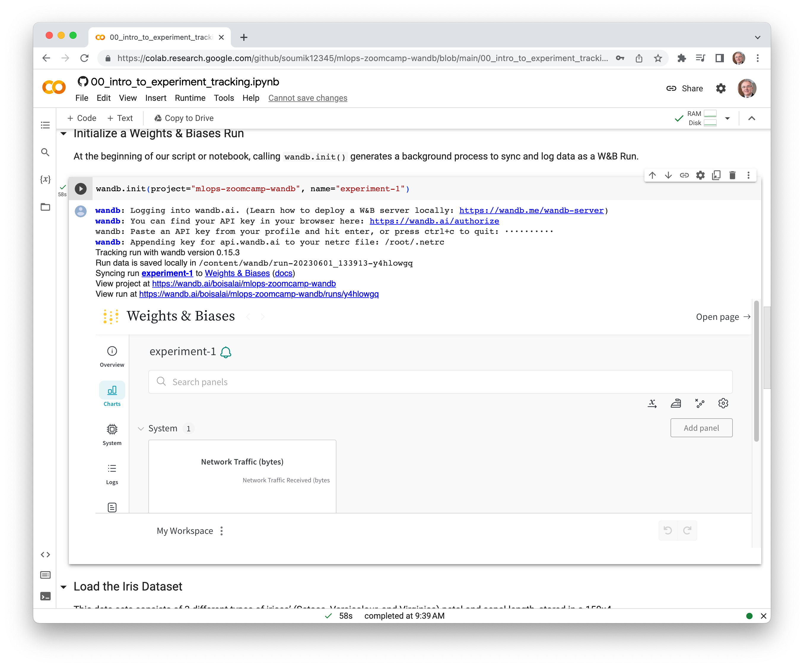
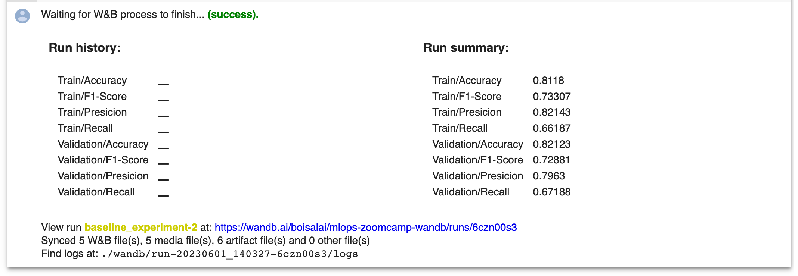

# MLOps ZoomCamp: Experiment Tracking with Weights & Biases

See https://github.com/soumik12345/mlops-zoomcamp-wandb.

## Introduction to Experiment Tracking with Weights & Biases

<a target="_blank" href="https://colab.research.google.com/github/soumik12345/mlops-zoomcamp-wandb/blob/main/00_intro_to_experiment_tracking.ipynb">
  
</a>


In this notebook, we will explore the following

* Versioning datasets using [Artifacts](https://docs.wandb.ai/guides/artifacts).
* Exploring and visualizing our datasets with [Tables](https://docs.wandb.ai/guides/data-vis).
* Baseline Experiment with a Random Forest Classification Model.

Here is the code below.

```python
# Setup Dependencies
!pip install pandas matplotlib scikit-learn pyarrow
!pip install wandb

# Import Libraries
import wandb

import pickle

from sklearn.linear_model import LogisticRegression
from sklearn.datasets import load_iris
from sklearn.metrics import accuracy_score, mean_squared_error

# Initialize a Weights & Biases Run
wandb.init(project="mlops-zoomcamp-wandb", name="experiment-1")
```

You should see something like this.



```python
# Load the Iris Dataset
X, y = load_iris(return_X_y=True)
label_names = ["Setosa", "Versicolour", "Virginica"]

# Training Model and Experiment Tracking
# Log your model configs to Weights & Biases
params = {"C": 0.1, "random_state": 42}
wandb.config = params

model = LogisticRegression(**params).fit(X, y)
y_pred = model.predict(X)
y_probas = model.predict_proba(X)

wandb.log({
    "accuracy": accuracy_score(y, y_pred),
    "mean_squared_error": mean_squared_error(y, y_pred)
})

# Visualize and Compare Plots using Weights & Biases
wandb.sklearn.plot_roc(y, y_probas, labels=label_names)
wandb.sklearn.plot_precision_recall(y, y_probas, labels=label_names)
wandb.sklearn.plot_confusion_matrix(y, y_pred, labels=label_names)
```

See [here](https://docs.wandb.ai/guides/integrations/scikit) for more information about Scikit-Learn integration.

```python
# Logging Model to Weights & Biases
# Save your model
with open("logistic_regression.pkl", "wb") as f:
    pickle.dump(model, f)

# Log your model as a versioned file to Weights & Biases Artifact
artifact = wandb.Artifact(f"iris-logistic-regression-model", type="model")
artifact.add_file("logistic_regression.pkl")
wandb.log_artifact(artifact)
# <wandb.sdk.wandb_artifacts.Artifact at 0x7fa7051c70d0>

# Finish the Experiment
wandb.finish()
```

## Diving Deeper into Weights & Biases Offerings

<a target="_blank" href="https://colab.research.google.com/github/soumik12345/mlops-zoomcamp-wandb/blob/main/01_diving_deeper_into_wandb.ipynb">
  
</a>


Here is the code below.

```python
# Import the Libraries.
import os
import pickle

import wandb
import pandas as pd

from sklearn.ensemble import RandomForestClassifier
from sklearn.metrics import accuracy_score, f1_score, precision_score, recall_score
```

Download the `train.csv` and `test.csv` files from [Titanic - Machine Learning from Disaster](https://www.kaggle.com/competitions/titanic/data) and place them in the `data` directory.

Here is the code to do this in colab.

```python
from google.colab import files

# Upload `train.csv` and `test.csv`.
uploaded = files.upload()

!mkdir data
!mv *.csv data
```
 
```python
# Logging Dataset to Artifacts
# Initialize a WandB Run
wandb.init(project="mlops-zoomcamp-wandb", job_type="log_data")

# Log the `data` directory as an artifact
artifact = wandb.Artifact('Titanic', type='dataset', metadata={"Source": "https://www.kaggle.com/competitions/titanic/data"})
artifact.add_dir('data')
wandb.log_artifact(artifact)

# End the WandB Run
wandb.finish()
```

You should see something like this.

```txt
wandb: Appending key for api.wandb.ai to your netrc file: /root/.netrc
Tracking run with wandb version 0.15.3
Run data is saved locally in /content/wandb/run-20230601_135759-gfyfki4e
Syncing run resilient-aardvark-2 to Weights & Biases (docs)
View project at https://wandb.ai/boisalai/mlops-zoomcamp-wandb
View run at https://wandb.ai/boisalai/mlops-zoomcamp-wandb/runs/gfyfki4e
wandb: Adding directory to artifact (./data)... Done. 0.0s
Waiting for W&B process to finish... (success).
View run resilient-aardvark-2 at: https://wandb.ai/boisalai/mlops-zoomcamp-wandb/runs/gfyfki4e
Synced 5 W&B file(s), 0 media file(s), 2 artifact file(s) and 0 other file(s)
Find logs at: ./wandb/run-20230601_135759-gfyfki4e/logs
```

Versioning the Data.

```python
# Initialize a WandB Run
wandb.init(project="mlops-zoomcamp-wandb", job_type="log_data")

# Fetch the dataset artifact 
# Don't forget to change your name account (mine is `boisalai`)
artifact = wandb.use_artifact('boisalai/mlops-zoomcamp-wandb/Titanic:v0', type='dataset')
artifact_dir = artifact.download()

# Read the dataset files
train_df = pd.read_csv(os.path.join(artifact_dir, "train.csv"))
test_df = pd.read_csv(os.path.join(artifact_dir, "test.csv"))

num_train_examples = int(0.8 * len(train_df))
num_val_examples = len(train_df) - num_train_examples

print(num_train_examples, num_val_examples)
# 712 179

train_df["Split"] = ["Train"] * num_train_examples + ["Validation"] * num_val_examples
train_df.to_csv("data/train.csv", encoding='utf-8', index=False)

# Log the `data` directory as an artifact
artifact = wandb.Artifact('Titanic', type='dataset', metadata={"Source": "https://www.kaggle.com/competitions/titanic/data"})
artifact.add_dir('data')
wandb.log_artifact(artifact)

# End the WandB Run
wandb.finish()
```

Explore the Dataset.

```python
# Initialize a WandB Run
wandb.init(project="mlops-zoomcamp-wandb", job_type="explore_data")

# Fetch the latest version of the dataset artifact 
# Don't forget to change your name account (mine is `boisalai`)
artifact = wandb.use_artifact('boisalai/mlops-zoomcamp-wandb/Titanic:latest', type='dataset')
artifact_dir = artifact.download()

# Read the files
train_val_df = pd.read_csv(os.path.join(artifact_dir, "train.csv"))
test_df = pd.read_csv(os.path.join(artifact_dir, "test.csv"))

# Create tables corresponding to datasets
train_val_table = wandb.Table(dataframe=train_val_df)
test_table = wandb.Table(dataframe=test_df)

# Log the tables to Weights & Biases
wandb.log({
    "Train-Val-Table": train_val_table,
    "Test-Table": test_table
})

# End the WandB Run
wandb.finish()
```

Fit a Baseline Model.

```python
# Initialize a WandB Run
wandb.init(project="mlops-zoomcamp-wandb", name="baseline_experiment-2", job_type="train")

# Fetch the latest version of the dataset artifact 
# Don't forget to change your name account (mine is `boisalai`)
artifact = wandb.use_artifact('boisalai/mlops-zoomcamp-wandb/Titanic:latest', type='dataset')
artifact_dir = artifact.download()

# Read the files
train_val_df = pd.read_csv(os.path.join(artifact_dir, "train.csv"))
test_df = pd.read_csv(os.path.join(artifact_dir, "test.csv"))

features = ["Pclass", "Sex", "SibSp", "Parch"]
X_train = pd.get_dummies(train_val_df[features][train_val_df["Split"] == "Train"])
X_val = pd.get_dummies(train_val_df[features][train_val_df["Split"] == "Validation"])
y_train = train_val_df["Survived"][train_val_df["Split"] == "Train"]
y_val = train_val_df["Survived"][train_val_df["Split"] == "Validation"]

model_params = {"n_estimators": 100, "max_depth": 10, "random_state": 1}
wandb.config = model_params

model = RandomForestClassifier(**model_params)
model.fit(X_train, y_train)

y_pred_train = model.predict(X_train)
y_probas_train = model.predict_proba(X_train)
y_pred_val = model.predict(X_val)
y_probas_val = model.predict_proba(X_val)

wandb.log({
    "Train/Accuracy": accuracy_score(y_train, y_pred_train),
    "Validation/Accuracy": accuracy_score(y_val, y_pred_val),
    "Train/Presicion": precision_score(y_train, y_pred_train),
    "Validation/Presicion": precision_score(y_val, y_pred_val),
    "Train/Recall": recall_score(y_train, y_pred_train),
    "Validation/Recall": recall_score(y_val, y_pred_val),
    "Train/F1-Score": f1_score(y_train, y_pred_train),
    "Validation/F1-Score": f1_score(y_val, y_pred_val),
})

label_names = ["Not-Survived", "Survived"]

wandb.sklearn.plot_class_proportions(y_train, y_val, label_names)
wandb.sklearn.plot_summary_metrics(model, X_train, y_train, X_val, y_val)
wandb.sklearn.plot_roc(y_val, y_probas_val, labels=label_names)
wandb.sklearn.plot_precision_recall(y_val, y_probas_val, labels=label_names)
wandb.sklearn.plot_confusion_matrix(y_val, y_pred_val, labels=label_names)

# Save your model
with open("random_forest_classifier.pkl", "wb") as f:
    pickle.dump(model, f)

# Log your model as a versioned file to Weights & Biases Artifact
artifact = wandb.Artifact(f"titanic-random-forest-model", type="model")
artifact.add_file("random_forest_classifier.pkl")
wandb.log_artifact(artifact)

# End the WandB Run
wandb.finish()
```

You should see something like this in the output.



## Hyperparameter Optimization with Weights & Biases

See [Python script](https://github.com/soumik12345/mlops-zoomcamp-wandb/blob/main/02_hyperparameter_optimization.py).

Here is the code below.

```python
import os
import pickle

from sklearn.ensemble import RandomForestClassifier
from sklearn.metrics import accuracy_score, f1_score, precision_score, recall_score

import wandb
import pandas as pd


def run_train():
    # Initialize a WandB Run
    wandb.init()

    # Get hyperparameters from the run configs
    config = wandb.config

    # Fetch the latest version of the dataset artifact 
    artifact = wandb.use_artifact('geekyrakshit/mlops-zoomcamp-wandb/Titanic:latest', type='dataset')
    artifact_dir = artifact.download()

    # Read the files
    train_val_df = pd.read_csv(os.path.join(artifact_dir, "train.csv"))

    features = ["Pclass", "Sex", "SibSp", "Parch"]
    X_train = pd.get_dummies(train_val_df[features][train_val_df["Split"] == "Train"])
    X_val = pd.get_dummies(train_val_df[features][train_val_df["Split"] == "Validation"])
    y_train = train_val_df["Survived"][train_val_df["Split"] == "Train"]
    y_val = train_val_df["Survived"][train_val_df["Split"] == "Validation"]

    # Define and Train RandomForestClassifier model
    model = RandomForestClassifier(
        n_estimators=config.n_estimators,
        max_depth=config.max_depth,
        min_samples_split=config.min_samples_split,
        min_samples_leaf=config.min_samples_leaf,
        bootstrap=config.bootstrap,
        warm_start=config.warm_start,
        class_weight=config.class_weight,
    )
    model.fit(X_train, y_train)

    # Make Predictions
    y_pred_train = model.predict(X_train)
    y_pred_val = model.predict(X_val)
    y_probas_val = model.predict_proba(X_val)

    # Log Metrics to Weights & Biases
    wandb.log({
        "Train/Accuracy": accuracy_score(y_train, y_pred_train),
        "Validation/Accuracy": accuracy_score(y_val, y_pred_val),
        "Train/Presicion": precision_score(y_train, y_pred_train),
        "Validation/Presicion": precision_score(y_val, y_pred_val),
        "Train/Recall": recall_score(y_train, y_pred_train),
        "Validation/Recall": recall_score(y_val, y_pred_val),
        "Train/F1-Score": f1_score(y_train, y_pred_train),
        "Validation/F1-Score": f1_score(y_val, y_pred_val),
    })

    # Plot plots to Weights & Biases
    label_names = ["Not-Survived", "Survived"]
    wandb.sklearn.plot_class_proportions(y_train, y_val, label_names)
    wandb.sklearn.plot_summary_metrics(model, X_train, y_train, X_val, y_val)
    wandb.sklearn.plot_roc(y_val, y_probas_val, labels=label_names)
    wandb.sklearn.plot_precision_recall(y_val, y_probas_val, labels=label_names)
    wandb.sklearn.plot_confusion_matrix(y_val, y_pred_val, labels=label_names)

    # Save your model
    with open("random_forest_classifier.pkl", "wb") as f:
        pickle.dump(model, f)

    # Log your model as a versioned file to Weights & Biases Artifact
    artifact = wandb.Artifact("titanic-random-forest-model", type="model")
    artifact.add_file("random_forest_classifier.pkl")
    wandb.log_artifact(artifact)


SWEEP_CONFIG = {
    "method": "bayes",
    "metric": {"name": "Validation/Accuracy", "goal": "maximize"},
    "parameters": {
        "max_depth": {
            "distribution": "int_uniform",
            "min": 1,
            "max": 20,
        },
        "n_estimators": {
            "distribution": "int_uniform",
            "min": 10,
            "max": 100,
        },
        "min_samples_split": {
            "distribution": "int_uniform",
            "min": 2,
            "max": 10,
        },
        "min_samples_leaf": {
            "distribution": "int_uniform",
            "min": 1,
            "max": 4,
        },
        "bootstrap": {"values": [True, False]},
        "warm_start": {"values": [True, False]},
        "class_weight": {"values": ["balanced", "balanced_subsample"]},
    },
}


if __name__ == "__main__":
    sweep_id = wandb.sweep(SWEEP_CONFIG, project="mlops-zoomcamp-wandb")
    wandb.agent(sweep_id, run_train, count=5)
```

## See also

* Check out Tutorials: https://docs.wandb.ai/tutorials
* Read ML Reports at: https://wandb.ai/fully-connected
* The W&B Courses: https://www.wandb.courses/pages/w-b-courses
* [ntroduction to Hyperparameter Sweeps – A Model Battle Royale To Find The Best Model In 3 Steps](https://wandb.ai/site/articles/introduction-hyperparameter-sweeps)
* [Introduction to Hyperparameter Sweeps using W&B](https://colab.research.google.com/github/wandb/examples/blob/master/colabs/pytorch/Organizing_Hyperparameter_Sweeps_in_PyTorch_with_W%26B.ipynb#scrollTo=XiRJ8c3yJp4n) in Google Colab.

## Homework

See [homework](https://github.com/DataTalksClub/mlops-zoomcamp/blob/main/cohorts/2023/02-experiment-tracking/wandb.md).

